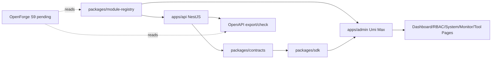

# OpenCore 架构总览

OpenCore 的中文名是“开元”，品牌语是“开放之源，万物之始”。项目定位是 **AI Native 企业级全栈 Monorepo**。

OpenCore 面向一人公司、小团队和现代企业应用开发，目标是在一个 monorepo 内统一管理 API、官方后台、官网、移动端、小程序、桌面端、共享契约、SDK、模块注册表、代码生成器 OpenForge 和 AI Native 能力预留。

## 当前实现状态

OpenCore 当前已经完成 S0/S1、D1-D6、S2、S3、S4、S5、S6、S7、S8。S9 OpenForge MVP 尚未开始。

| 层              | 当前状态                                                                                                                     |
| --------------- | ---------------------------------------------------------------------------------------------------------------------------- |
| API             | `apps/api` 已完成 NestJS 主干、health/readiness、OpenAPI export/check、API foundation、RBAC、系统管理、monitor/tool baseline |
| Admin           | `apps/admin` 已完成 Dashboard shell、异常页、request/access、RBAC 页面、系统管理页面、Monitor/Tool 页面                      |
| Contracts       | `packages/contracts` 已包含权限码、模块 schema、OpenAPI snapshot、table export contract                                      |
| SDK             | `packages/sdk` 已包含 RBAC、系统管理、监控、工具协议 typed client                                                            |
| Module Registry | `packages/module-registry` 已登记 S5-S8 模块、权限、菜单、OpenAPI tag，并阻止 P4/P5 泄漏                                     |
| Prisma          | 已建立 S6/S7 所需 User、Role、Permission、Menu、Dict、Config、File、Audit、LoginLog schema                                   |
| OpenForge       | 仍是路线图和 S9 目标，尚未实现写文件生成器                                                                                   |
| AI Native       | 仍为架构预留，不做知识库、RAG、Agent                                                                                         |

## 架构主线

## 当前非目标

- 不实现 P4/P5 模块：CRM、ERP、MES、WMS、商城、支付、会员、多租户、知识库、RAG、Agent。
- 不复制 RuoYi/Yudao 的 Java/Vue 代码。
- 不把微信、短信、邮件、支付 provider 放进 core。
- 不在 S8 中做完整任务调度平台、大数据异步导出或 OpenForge 写文件生成器。

## 官方主线

后端官方主线是 NestJS + Prisma + PostgreSQL + OpenAPI；Redis、BullMQ、MinIO/S3 在后续运行阶段继续接入。

前端官方后台主线是 Umi Max + Ant Design Pro V6 + ProComponents v3 + antd 6 + React 19。

OpenCore 不迁移到 Refine，不使用 Vue，不使用 Java，官方 admin 不使用 MUI。其他 UI 方案可以在未来作为额外 app 存在，例如 `apps/admin-mui`。
