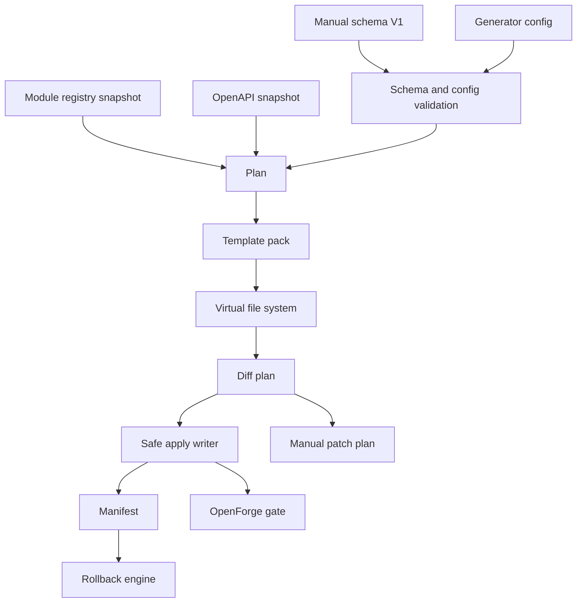

# OpenForge V1 Architecture

更新时间：2026-06-10

OpenForge V1 的目标是把 S9 只读 plan/diff/check 升级为安全、可审计、可回滚的生成器闭环。V1 仍然服务 OpenCore 的 TypeScript 主线：NestJS API、Umi Max Admin、contracts、SDK、module registry、测试和文档。

V1 不改变 OpenCore 的业务边界：它只生成平台开发骨架和 reviewable patch plan，不实现 CRM、ERP、MES、WMS、商城、支付、会员、多租户、Knowledge、RAG、Agent 或 AI workflow。

## S9 Audit

当前 S9 已完成：

| Area            | Current Evidence                                                                                           |
| --------------- | ---------------------------------------------------------------------------------------------------------- |
| Module registry | `tool.openforge` 已登记，权限为 `tool:openforge:read` 和 `tool:openforge:manage`                           |
| Contracts       | `packages/contracts/src/openforge-contract.ts` 导出 S9 read-only plan、diff、preflight contract            |
| Workspace tool  | `tools/generator` 是 pnpm workspace 和 Nx CLI project，项目名为 `openforge`                                |
| Generator core  | `packages/generator-core` 是 pnpm workspace 和 Nx library project，项目名为 `generator-core`               |
| CLI             | `pnpm openforge:plan`、`pnpm openforge:diff`、`pnpm openforge:check` 和 `pnpm openforge:status` 可运行     |
| Readers         | 只读读取 module registry、OpenAPI snapshot 和 manual schema fixture                                        |
| Planner         | 生成 deterministic generate plan，包含 API/Admin/SDK/Test/Docs/Prisma hint artifact                        |
| Diff            | 生成 readonly diff plan，区分 `would-create`、`would-update`、`unchanged`、`blocked`、`protected-conflict` |
| Safety          | 阻止绝对路径、`../`、`.env*`、`prisma/schema.prisma`、`prisma/migrations/**` 和 P4/P5 schema               |
| Tests           | Generator-core reader、validator、planner、diff、preflight、safety tests 与 OpenForge CLI tests 已存在     |

Stage B-L 已补齐 V1 contract surface、schema/config DSL、template pack/VFS、safe apply writer、rollback engine、API generator pack、Admin generator pack、SDK/Test/Docs generator pack、CLI doctor、temp repo e2e、OpenForge gate 和最终文档交接。

## V1 Flow



## Layer Responsibilities

| Layer         | Responsibility                                                                                 | V1 Rule                                                                     |
| ------------- | ---------------------------------------------------------------------------------------------- | --------------------------------------------------------------------------- |
| Contract      | Define template, generated file, marker, patch, apply, manifest, rollback and config protocols | No Node `fs` dependency in contracts                                        |
| Schema/config | Validate manual schema and generator policy before planning                                    | Reject P4/P5, unsafe paths, forbidden Prisma writes and invalid permissions |
| Reader        | Read module registry, OpenAPI and schema/config inputs                                         | Do not read `.env*` or secrets                                              |
| Planner       | Produce deterministic plan from validated inputs                                               | Default dry-run, include safety and next commands                           |
| Template      | Render maintainable template pack artifacts                                                    | No ad hoc untestable string sprawl                                          |
| VFS           | Hold target path, content, hash, marker and patch-only metadata before disk writes             | No direct filesystem mutation                                               |
| Diff          | Compare VFS against current repo state                                                         | Human files without marker become `protected-conflict`                      |
| Apply         | Write only allowed generated-owned files with explicit `--yes`                                 | Default dry-run; two-phase write and hash verify                            |
| Manifest      | Record apply inputs, hashes, actions and rollback actions                                      | No secrets in manifest                                                      |
| Rollback      | Revert only files recorded by manifest and still safe to touch                                 | Block if generated files were manually modified                             |
| CI gate       | Run status/doctor/check/diff/test commands in a repeatable local gate                          | Keep OpenForge enforceable before S10+ modules                              |

## Current V1 Stage Status

| Stage   | Status   | Evidence                                                                                                                                                                                                                    |
| ------- | -------- | --------------------------------------------------------------------------------------------------------------------------------------------------------------------------------------------------------------------------- |
| Stage A | complete | This architecture document, roadmap update and progress ledger entry exist                                                                                                                                                  |
| Stage B | complete | `packages/contracts/src/openforge-contract.ts` exports V1 template/apply/manifest/rollback/marker/patch/config contracts and pure marker/apply validation helpers                                                           |
| Stage C | complete | `packages/generator-core/src/schema/**` and `packages/generator-core/src/config/**` validate Schema/config DSL V1, with legal and illegal V1 fixtures under `tools/generator/examples`                                      |
| Stage D | complete | `openforge-default-nest-umi-v1` template pack, render layer, VFS helpers and golden snapshot tests render API/Admin/SDK/Test/Docs/Prisma/Patch virtual files in memory                                                      |
| Stage E | complete | `packages/generator-core/src/apply/apply-writer.ts` applies generated-owned VFS output only with explicit `--yes`, defaults to dry-run, writes manifests, verifies hashes and rolls back partial writes                     |
| Stage F | complete | `packages/generator-core/src/rollback/rollback-engine.ts` plans and applies manifest rollback, blocks modified generated files, restores from apply backups, and writes rollback audit records                              |
| Stage G | complete | API generator pack renders NestJS module/controller/service/repository/DTO/spec skeletons with Swagger decorators, `RequirePermission`, no Prisma access, patch-only app module registration and API golden/typecheck tests |
| Stage H | complete | Admin generator pack renders ProTable page, Modal/Drawer forms, ProDescriptions detail, export button and smoke skeletons with permission-aware operations, placeholder client calls and patch-only route/access plans      |
| Stage I | complete | SDK/Test/Docs generator pack renders generated SDK types/client/spec/index, API/Admin generated tests, module/API/Admin/runbook/patch-review docs, SDK index patch plan, snapshots and temp-project SDK typecheck           |
| Stage J | complete | CLI UX includes `openforge:doctor`, clearer help/unknown-command handling, temp repo plan/diff/apply/idempotency/conflict/rollback e2e, and all-skipped apply no-op behavior                                                |
| Stage K | complete | Root scripts `openforge:status`, `openforge:test` and `openforge:gate` exist, local CI gate docs define full command sequence and no-write checks, and gate runs locally                                                    |
| Stage L | complete | Final README/docs/handoff/strategy/module docs plus schema/template/apply authoring docs document V1 operation, S10 usage, generated marker review, manifests and rollback                                                  |

The recursive quality-cycle gate runs the OpenForge no-write gate alongside OpenCore-specific drift checks: `pnpm registry:admin-routes:check` and `pnpm openapi:registry-tags:check`.

## Generated Ownership Model

OpenForge V1 distinguishes three ownership classes:

| Class                | Example                                                                                                                                | Automation                                           |
| -------------------- | -------------------------------------------------------------------------------------------------------------------------------------- | ---------------------------------------------------- |
| Generated-owned file | `apps/api/src/modules/generated/core/dict/dict.controller.ts`                                                                          | May create or update when marker is valid            |
| Patch-only plan      | `apps/api/src/app/app.module.ts`, `apps/admin/config/routes.ts`, `apps/admin/src/access.ts`, `packages/module-registry/src/modules.ts` | Never auto-modify unless the file is generated-owned |
| Protected file       | `.env*`, `prisma/schema.prisma`, `prisma/migrations/**`                                                                                | Always blocked                                       |

Generated-owned files must include a parseable OpenForge marker containing:

```text
@generated by OpenForge
templateVersion
schemaHash
moduleCode
artifactKind
generatedAt
```

## Template Pack Boundary

The default V1 template pack is `openforge-default-nest-umi-v1`. Current Stage I output covers:

- API: module, controller, service, DTO, repository and spec skeleton.
- Controller uses `@ApiTags`, operation/response/body/param Swagger decorators and `@RequirePermission`.
- DTOs include Swagger property decorators and schema-derived TypeScript field types.
- List query DTOs must use bounded filter fields rather than arbitrary SQL/JSON query pass-throughs.
- Detail endpoints use read permissions, reuse the same DTOs as list rows when safe, and document deleted/hidden record handling plus secret redaction.
- Action endpoints must validate current state before mutation: deleted/terminal collaboration records, disabled jobs, revoked sessions, disabled providers, wrong provider channels and disabled templates are rejected.
- Broad or destructive actions must expose a dry-run or explicit confirmation contract instead of running silently.
- Service delegates to a generated repository contract and does not access Prisma.
- Repository is a generated placeholder and must be replaced before production registration.
- API app module registration remains a patch-only markdown plan.

- Admin: ProTable page, ModalForm or DrawerForm, read-only ProDescriptions/detail drawer, export button and smoke test skeleton.
- Admin page uses generated client placeholders, loading/error/empty states, permission-aware operation buttons and row-level detail openers by id/code.
- Admin list pages must expose bounded current-page filter controls that mirror declared list query DTO fields such as status, type, enabled, owner, prefix, provider code or assignee. Generated filters are field-specific search/select controls, not arbitrary query builders.
- Admin generator output uses the shared `useCurrentPageFilters` hook and binds
  both table data and current-page CSV export to `filteredRows`.
- Admin generator output treats explicit `sensitive` and `detailOnly` field
  metadata as safety contracts. It also falls back to conservative field-name
  classification for payload, body, comment, query schema, config, token,
  secret, credential, authorization, API key and client secret names.
- Admin current-page filter/search text normalization must apply recursive sensitive-key redaction before object fallback JSON stringification for password, secret, token, credential, authorization, API key and client secret fields.
- Admin core wrappers, including RBAC and system management tables, must bind ProTable data and CSV export to shared bounded current-page filter results.
- Admin core wrappers must render an explicit read-only reason while data is fixture-backed or summary-only.
- Admin core wrappers must accept explicit read-only detail metadata and render shared detail drawers from stable row identifiers.
- Admin RBAC mutation-looking controls must stay disabled with that read-only reason until real permission-guarded write contracts are admitted.
- Admin detail drawers must remain read-only, display the same hidden-record/redaction policy as the API detail endpoint, and keep design-only integration topics visibly design-only.
- Admin detail field metadata must mark scalar token ids, secret refs, credentials, authorization values and other sensitive fields as `sensitive` so the shared detail drawer renders `[redacted]`.
- Admin generated detail components must use `ReadOnlyDetailDrawer`,
  `DetailField`, and `DetailJsonSection` instead of standalone
  `ProDescriptions` scalar rendering.
- Admin detail JSON sections must pass through the shared recursive sensitive-key redaction guard before JSON serialization, covering nested arrays/objects for password, secret, token, credential, authorization, API key and client secret fields.
- Admin system config detail drawers must redact values with `secret` visibility using the same formatter as current-page export.
- Admin export buttons are current-page CSV only, bounded by the S8 `CURRENT_PAGE_EXPORT_PROTOCOL`, and must exclude sensitive/detail-only columns before serialization. System config exports must redact values with `secret` visibility.
- Admin generated export templates must emit `CurrentPageExportColumn` metadata
  and call the shared `CurrentPageExportButton`; generated templates must not
  duplicate CSV/download serialization or rely on an empty `onExport(columns)`
  callback.
- Admin export buttons must serialize the currently filtered current-page rows so list filter, detail and export semantics stay aligned.
- Admin CSV export filenames must be sanitized to local `.csv` basenames before browser download.
- Admin CSV exports must neutralize spreadsheet formula prefixes before cell serialization. Values beginning with optional whitespace followed by `=`, `+`, `-` or `@` are exported as text with an apostrophe prefix.
- Admin export object-cell fallback serialization must apply recursive sensitive-key redaction before JSON stringification for password, secret, token, credential, authorization, API key and client secret fields.
- Admin route/access integration remains patch-only markdown; OpenForge does not modify `config/routes.ts` or `access.ts`.

- SDK: generated schema-derived types, generated request wrapper client, generated client spec and generated barrel file.
- SDK index integration remains patch-only markdown; OpenForge does not modify hand-written SDK entrypoints.
- Tests: generated API spec asserts DTO shape, permission guard metadata and repository placeholder behavior; generated Admin smoke asserts route, permission map and operation permission helpers.
- Docs: generated module, API, Admin, runbook and patch-review fragments include `schemaHash` and `templateVersion` review metadata.

Stage J CLI/doctor/e2e covers:

- Doctor: workspace root, pnpm workspace, CLI Nx project, generator-core Nx project, contracts export, module registry validation, OpenAPI snapshot, OpenAPI drift command, example schemas, template pack, protected paths and manifest directory status.
- E2E: temp repo plan/diff/apply `--yes`, generated file verification, idempotent reapply, human-authored conflict detection and rollback cleanup.
- Recursive gate integration: OpenForge remains no-write while the quality-cycle script also runs admin route/access drift and registry tag drift checks around OpenAPI export/check.

Established V1 boundaries that remain in force:

- Prisma output is model draft and migration hint only.
- Patch output is app module, admin route, admin access, module registry and SDK index patch plans.
- V1 final documentation is the handoff source of truth for future S10 usage.

Prisma output remains draft/hint only. OpenForge must not directly write `prisma/schema.prisma` or create `prisma/migrations/**`.

## Apply And Rollback

Stage E introduces `apply`; it remains dry-run by default and only writes with explicit `--yes`. Stage F introduces manifest rollback and manifest inspection:

```bash
pnpm openforge:apply -- --schema <schema> --config <config> --dry-run
pnpm openforge:apply -- --schema <schema> --config <config> --yes
pnpm openforge:rollback -- --manifest <manifest> --dry-run
pnpm openforge:rollback -- --manifest <manifest> --yes
pnpm openforge:manifest -- --list
pnpm openforge:manifest -- --show <id>
pnpm openforge:doctor
pnpm openforge:status
pnpm openforge:test
pnpm openforge:gate
```

Rollback uses only manifest entries. Created files are deleted only when their current hash still matches the apply manifest and they still contain a valid OpenForge marker. Updated files are restored only when their current hash still matches the apply manifest and the Stage F backup hash matches the manifest `beforeHash`. Rollback writes `.openforge/rollbacks/*.json` audit records on successful write-mode rollback.

`pnpm openforge:doctor` is read-only and does not create `.openforge`. Real writes must require `--yes`; dry-run remains the default. A write-mode apply where every entry is already unchanged is a no-op and does not overwrite the previous manifest.

## OpenForge Gate

Stage K introduces `pnpm openforge:gate`, which runs:

```bash
pnpm openforge:status
pnpm openforge:doctor
pnpm openforge:check -- --schema tools/generator/examples/core.dict.v1.schema.json
pnpm openforge:diff -- --schema tools/generator/examples/core.dict.v1.schema.json --format json
```

The full local CI sequence is documented in [OpenForge CI Gate](openforge-ci-gate.md). Gate commands are read-only and must not leave `.openforge`, generated API/Admin directories, `docs/generated/openforge`, `openforge-patches`, SDK generated output or Prisma draft output in the repo.

## Authoring And Operations Docs

- [OpenForge Schema Authoring](openforge-schema-authoring.md)
- [OpenForge Template Authoring](openforge-template-authoring.md)
- [OpenForge Apply And Rollback Runbook](openforge-apply-rollback-runbook.md)
- [OpenForge CI Gate](openforge-ci-gate.md)

For S10 collaboration, use OpenForge only after module registry, permissions and OpenAPI tags are defined. Generate skeletons, review patch plans, keep repositories as placeholders until persistence is explicitly authorized, and keep full workflow/BPMN/P4/P5/AI modules out of scope.

## Scope Guard

- No human-authored file overwritten.
- No `.env` or secret read, printed or committed.
- No Prisma schema generated or modified by OpenForge.
- No Prisma migration generated by OpenForge.
- No P4/P5 module implemented.
- No CRM, ERP, MES, WMS, mall, payment, member or multitenancy implemented.
- No Knowledge, RAG, Agent or AI workflow implemented.
- No RuoYi/Yudao Java/Vue code copied.
- No NestWeb/Antdpro6 business code migrated.
