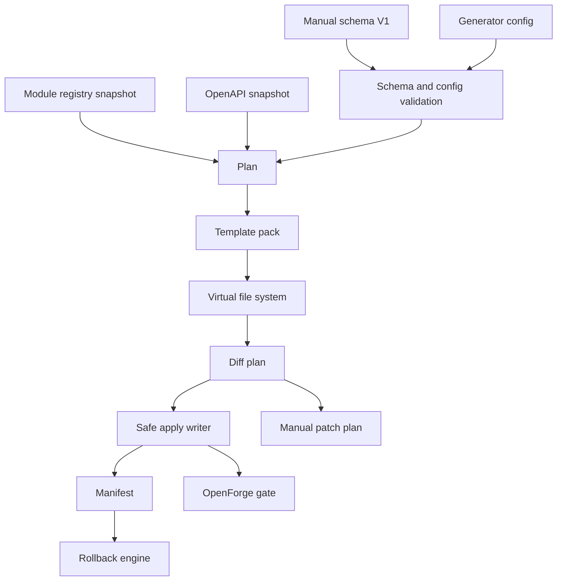

# OpenForge V1 Architecture

更新时间：2026-06-10

OpenForge V1 的目标是把 S9 只读 plan/diff/check 升级为安全、可审计、可回滚的生成器闭环。V1 仍然服务 OpenCore 的 TypeScript 主线：NestJS API、Umi Max Admin、contracts、SDK、module registry、测试和文档。

V1 不改变 OpenCore 的业务边界：它只生成平台开发骨架和 reviewable patch plan，不实现 CRM、ERP、MES、WMS、商城、支付、会员、多租户、Knowledge、RAG、Agent 或 AI workflow。

## S9 Audit

当前 S9 已完成：

| Area            | Current Evidence                                                                                           |
| --------------- | ---------------------------------------------------------------------------------------------------------- |
| Module registry | `tool.openforge` 已登记，权限为 `tool:openforge:read` 和 `tool:openforge:manage`                           |
| Contracts       | `packages/contracts/src/openforge-contract.ts` 导出 S9 read-only plan、diff、preflight contract            |
| Workspace tool  | `tools/generator` 是 pnpm workspace 和 Nx project，项目名为 `openforge`                                    |
| CLI             | `pnpm openforge:plan`、`pnpm openforge:diff`、`pnpm openforge:check` 可运行                                |
| Readers         | 只读读取 module registry、OpenAPI snapshot 和 manual schema fixture                                        |
| Planner         | 生成 deterministic generate plan，包含 API/Admin/SDK/Test/Docs/Prisma hint artifact                        |
| Diff            | 生成 readonly diff plan，区分 `would-create`、`would-update`、`unchanged`、`blocked`、`protected-conflict` |
| Safety          | 阻止绝对路径、`../`、`.env*`、`prisma/schema.prisma`、`prisma/migrations/**` 和 P4/P5 schema               |
| Tests           | OpenForge reader、validator、planner、diff、preflight、CLI 和 safety tests 已存在                          |

Stage B-I 已补齐 V1 contract surface、schema/config DSL、template pack/VFS、safe apply writer、rollback engine、API generator pack、Admin generator pack 和 SDK/Test/Docs generator pack。后续仍缺少实现层：

- 无 `doctor` CLI。
- 无 OpenForge V1 gate。

## V1 Flow



## Layer Responsibilities

| Layer         | Responsibility                                                                                 | V1 Rule                                                                     |
| ------------- | ---------------------------------------------------------------------------------------------- | --------------------------------------------------------------------------- |
| Contract      | Define template, generated file, marker, patch, apply, manifest, rollback and config protocols | No Node `fs` dependency in contracts                                        |
| Schema/config | Validate manual schema and generator policy before planning                                    | Reject P4/P5, unsafe paths, forbidden Prisma writes and invalid permissions |
| Reader        | Read module registry, OpenAPI and schema/config inputs                                         | Do not read `.env*` or secrets                                              |
| Planner       | Produce deterministic plan from validated inputs                                               | Default dry-run, include safety and next commands                           |
| Template      | Render maintainable template pack artifacts                                                    | No ad hoc untestable string sprawl                                          |
| VFS           | Hold target path, content, hash, marker and patch-only metadata before disk writes             | No direct filesystem mutation                                               |
| Diff          | Compare VFS against current repo state                                                         | Human files without marker become `protected-conflict`                      |
| Apply         | Write only allowed generated-owned files with explicit `--yes`                                 | Default dry-run; two-phase write and hash verify                            |
| Manifest      | Record apply inputs, hashes, actions and rollback actions                                      | No secrets in manifest                                                      |
| Rollback      | Revert only files recorded by manifest and still safe to touch                                 | Block if generated files were manually modified                             |
| CI gate       | Run doctor/check/diff/test commands in a repeatable local gate                                 | Keep OpenForge enforceable before S10+ modules                              |

## Current V1 Stage Status

| Stage     | Status   | Evidence                                                                                                                                                                                                                    |
| --------- | -------- | --------------------------------------------------------------------------------------------------------------------------------------------------------------------------------------------------------------------------- |
| Stage A   | complete | This architecture document, roadmap update and progress ledger entry exist                                                                                                                                                  |
| Stage B   | complete | `packages/contracts/src/openforge-contract.ts` exports V1 template/apply/manifest/rollback/marker/patch/config contracts and pure marker/apply validation helpers                                                           |
| Stage C   | complete | `tools/generator/src/schema/**` and `tools/generator/src/config/**` validate Schema/config DSL V1, with legal and illegal V1 fixtures under `tools/generator/examples`                                                      |
| Stage D   | complete | `openforge-default-nest-umi-v1` template pack, render layer, VFS helpers and golden snapshot tests render API/Admin/SDK/Test/Docs/Prisma/Patch virtual files in memory                                                      |
| Stage E   | complete | `tools/generator/src/apply/apply-writer.ts` applies generated-owned VFS output only with explicit `--yes`, defaults to dry-run, writes manifests, verifies hashes and rolls back partial writes                             |
| Stage F   | complete | `tools/generator/src/rollback/rollback-engine.ts` plans and applies manifest rollback, blocks modified generated files, restores from apply backups, and writes rollback audit records                                      |
| Stage G   | complete | API generator pack renders NestJS module/controller/service/repository/DTO/spec skeletons with Swagger decorators, `RequirePermission`, no Prisma access, patch-only app module registration and API golden/typecheck tests |
| Stage H   | complete | Admin generator pack renders ProTable page, Modal/Drawer forms, ProDescriptions detail, export button and smoke skeletons with permission-aware operations, placeholder client calls and patch-only route/access plans      |
| Stage I   | complete | SDK/Test/Docs generator pack renders generated SDK types/client/spec/index, API/Admin generated tests, module/API/Admin/runbook/patch-review docs, SDK index patch plan, snapshots and temp-project SDK typecheck           |
| Stage J-L | pending  | Doctor/e2e/gate and final docs are not implemented yet                                                                                                                                                                      |

## Generated Ownership Model

OpenForge V1 distinguishes three ownership classes:

| Class                | Example                                                                                                                         | Automation                                           |
| -------------------- | ------------------------------------------------------------------------------------------------------------------------------- | ---------------------------------------------------- |
| Generated-owned file | `apps/api/src/modules/generated/core/dict/dict.controller.ts`                                                                   | May create or update when marker is valid            |
| Patch-only plan      | `apps/api/src/app/app.module.ts`, `apps/admin/.umirc.ts`, `apps/admin/src/access.ts`, `packages/module-registry/src/modules.ts` | Never auto-modify unless the file is generated-owned |
| Protected file       | `.env*`, `prisma/schema.prisma`, `prisma/migrations/**`                                                                         | Always blocked                                       |

Generated-owned files must include a parseable OpenForge marker containing:

```text
@generated by OpenForge
templateVersion
schemaHash
moduleCode
artifactKind
generatedAt
```

## Template Pack Boundary

The default V1 template pack is `openforge-default-nest-umi-v1`. Current Stage I output covers:

- API: module, controller, service, DTO, repository and spec skeleton.
- Controller uses `@ApiTags`, operation/response/body/param Swagger decorators and `@RequirePermission`.
- DTOs include Swagger property decorators and schema-derived TypeScript field types.
- Service delegates to a generated repository contract and does not access Prisma.
- Repository is a generated placeholder and must be replaced before production registration.
- API app module registration remains a patch-only markdown plan.

- Admin: ProTable page, ModalForm or DrawerForm, ProDescriptions detail, export button and smoke test skeleton.
- Admin page uses generated client placeholders, loading/error/empty states and permission-aware operation buttons.
- Admin route/access integration remains patch-only markdown; OpenForge does not modify `.umirc.ts` or `access.ts`.

- SDK: generated schema-derived types, generated request wrapper client, generated client spec and generated barrel file.
- SDK index integration remains patch-only markdown; OpenForge does not modify hand-written SDK entrypoints.
- Tests: generated API spec asserts DTO shape, permission guard metadata and repository placeholder behavior; generated Admin smoke asserts route, permission map and operation permission helpers.
- Docs: generated module, API, Admin, runbook and patch-review fragments include `schemaHash` and `templateVersion` review metadata.

Later stages will harden:

- Doctor: CLI diagnostics for workspace readiness and safety boundaries.
- Gate: repeatable OpenForge V1 verification command set.
- Prisma: model draft and migration hint only.
- Patch: app module, admin route, admin access, module registry and SDK index patch plans.

Prisma output remains draft/hint only. OpenForge must not directly write `prisma/schema.prisma` or create `prisma/migrations/**`.

## Apply And Rollback

Stage E introduces `apply`; it remains dry-run by default and only writes with explicit `--yes`. Stage F introduces manifest rollback and manifest inspection:

```bash
pnpm openforge:apply -- --schema <schema> --config <config> --dry-run
pnpm openforge:apply -- --schema <schema> --config <config> --yes
pnpm openforge:rollback -- --manifest <manifest> --dry-run
pnpm openforge:rollback -- --manifest <manifest> --yes
pnpm openforge:manifest -- --list
pnpm openforge:manifest -- --show <id>
```

Rollback uses only manifest entries. Created files are deleted only when their current hash still matches the apply manifest and they still contain a valid OpenForge marker. Updated files are restored only when their current hash still matches the apply manifest and the Stage F backup hash matches the manifest `beforeHash`. Rollback writes `.openforge/rollbacks/*.json` audit records on successful write-mode rollback.

`pnpm openforge:doctor` remains planned for a later stage. Real writes must require `--yes`; dry-run remains the default.

## Scope Guard

- No human-authored file overwritten.
- No `.env` or secret read, printed or committed.
- No Prisma schema generated or modified by OpenForge.
- No Prisma migration generated by OpenForge.
- No P4/P5 module implemented.
- No CRM, ERP, MES, WMS, mall, payment, member or multitenancy implemented.
- No Knowledge, RAG, Agent or AI workflow implemented.
- No RuoYi/Yudao Java/Vue code copied.
- No NestWeb/Antdpro6 business code migrated.
