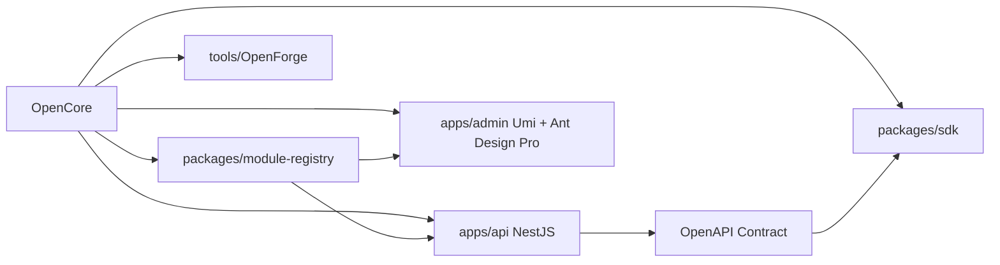

# OpenCore S3：战略蓝图 /goal Handoff

建议路径：

```text
docs/handoff/2026-06-10-strategy-blueprint-goal-handoff.md
```

更新时间：2026-06-10

## 1. 本阶段定位

本阶段不是写业务代码，也不是继续初始化项目，而是让 Codex 基于当前 OpenCore、旧项目 NestWeb/Antdpro6、RuoYi/Yudao 参考项目，产出一套“可理解、可追踪、可视化”的 OpenCore 未来能力蓝图。

目标是让项目 owner 能清楚知道：

```text
1. OpenCore 最终 API 能做什么。
2. OpenCore 最终 Admin 能有哪些页面。
3. 对标 RuoYi/Yudao 后，哪些模块要做、哪些不做、哪些以后做。
4. 旧项目 NestWeb / Antdpro6 哪些设计和代码经验可以复用。
5. 未来 S3、S4、S5... 的阶段路线是什么。
6. 如何用 Markdown + Mermaid + HTML 可视化理解整个系统。
```

本阶段输出的是战略文档包，不是业务实现。

---

## 2. 当前前置状态

OpenCore 当前状态：

```text
S0/S1：品牌、monorepo 骨架、pnpm workspace、Nx、占位目录、基础文档已完成。
D1-D6：平台边界、模块分类、契约与权限、API 启动计划、Admin 启动计划、OpenForge 路线已完成。
S2：apps/api 和 apps/admin 已初始化为空主干。
```

S2 当前目标仍然是：

```text
apps/api    NestJS 空应用 + health/live + health/ready + OpenAPI skeleton
apps/admin  Umi Max + Ant Design Pro V6 空后台
```

---

## 3. 必须参考的代码库

Codex 必须调研以下仓库后再输出文档：

```text
当前仓库：
- Gan-Xing/OpenCore

旧项目经验库：
- Gan-Xing/NestWeb
- Gan-Xing/Antdpro6

外部参考项目：
- https://github.com/YunaiV/ruoyi-vue-pro
- https://github.com/yudaocode/yudao-ui-admin-vue3
```

调研重点：

```text
OpenCore：当前 monorepo 结构、S2 状态、现有 docs。
NestWeb：RBAC、Role.code、OpenAPI、运行时配置、安全基线、Dashboard、文件、日志、消息、Approval Lite。
Antdpro6：Umi/Ant Design Pro 实践、access、request、OpenAPI service、ProTable 页面、E2E、导出、Dashboard。
RuoYi/Yudao：模块地图、权限粒度、菜单组织、代码生成器、精简版/完整版、system/infra/monitor/tool/business 模块边界。
```

禁止复制 Java/Vue 代码，只能学习架构、模块划分、菜单/权限粒度、功能优先级和产品形态。

---

## 4. 本阶段严格禁止

```text
不写业务代码
不实现登录
不实现 RBAC
不接数据库
不写 Prisma schema
不初始化 Next.js / Expo / Taro / Tauri
不实现知识库
不实现 RAG
不实现 Agent
不实现完整工作流
不实现 CRM / ERP / MES / WMS
不实现商城 / 支付 / 会员
不实现多租户
不删除现有文件
不大规模重构 apps/api 或 apps/admin
```

本阶段只允许新增/更新文档。

---

## 5. 最终必须产出的文档包

Codex 需要新增或更新以下文件。

### 5.1 战略入口

```text
docs/strategy/README.md
```

内容要求：

```text
- 如何阅读本战略包。
- 推荐阅读顺序。
- 哪些文件回答哪些问题。
- 当前阶段不是实现阶段。
- 后续每轮 Codex 必须更新 progress。
```

### 5.2 目标愿景

```text
docs/strategy/opencore-target-vision.md
```

必须回答：

```text
- OpenCore 最终是什么。
- 与 RuoYi/Yudao 的关系。
- 为什么学习其模块地图、权限粒度、代码生成器、精简版/完整版，而不复制 Java/Vue。
- OpenCore Lite / Full / AI Native Edition 的边界。
- apps/api 与 apps/admin 的核心职责。
```

必须包含 Mermaid 图：

```text
OpenCore Platform Overview
```

建议图形：



### 5.3 RuoYi/Yudao 能力对标矩阵

```text
docs/strategy/ruoyi-yudao-capability-matrix.md
```

必须包含一张大表格，字段至少包括：

```text
RuoYi/Yudao 模块名
模块分类
OpenCore 对应模块
OpenCore 层级
是否已有旧项目参考：NestWeb / Antdpro6 / none
当前状态：done / partial / planned / optional / not_now
推荐优先级：P0 / P1 / P2 / P3 / P4 / P5
是否进入 apps/api
是否进入 apps/admin
是否进入第一年路线
不做原因或延后原因
```

模块分类至少覆盖：

```text
system
infra
monitor
tool
collaboration
workflow
report
member
mall
pay
crm
erp
mes
wms
im
iot
ai
integration
```

### 5.4 API 最终架构蓝图

```text
docs/strategy/api-target-architecture.md
```

必须回答：

```text
- apps/api 最终模块目录结构。
- core / monitor / tool / collaboration / optional / industry / integration / ai 如何落地。
- 每类模块包含哪些 Controller / Service / DTO / Entity / OpenAPI tag。
- 从 NestWeb 可复用哪些后端经验。
- 哪些旧代码只借鉴不迁移。
- 推荐 S3-S8 后端建设顺序。
```

必须包含 Mermaid 图：

```text
API Module Layers
```

### 5.5 Admin 页面蓝图

```text
docs/strategy/admin-page-map.md
```

必须回答：

```text
- apps/admin 最终一级菜单设计。
- 每个一级菜单下有哪些页面。
- 哪些页面对标 RuoYi/Yudao。
- 哪些页面来自 Ant Design Pro 模板：Dashboard、表单、列表、详情、结果、异常、个人页、AI Assistant。
- 哪些页面第一阶段实现。
- 哪些页面作为 templates/examples 保留。
- 哪些页面后续 optional。
- 从 Antdpro6 可复用哪些前端经验。
- 推荐 S3-S8 前端建设顺序。
```

必须包含 Mermaid 图：

```text
Admin Menu Tree
```

### 5.6 旧项目复用审计

```text
docs/strategy/legacy-reuse-audit.md
```

必须审计：

```text
Gan-Xing/NestWeb
Gan-Xing/Antdpro6
```

必须分为：

```text
直接可迁移的经验
需要重写但可参考的模块
不建议迁移的模块
可作为 industry/integration/experimental 的模块
旧项目踩过的坑
OpenCore 中应该保留的设计原则
```

重点审计：

```text
Role.code
RBAC
OpenAPI drift check
i18n check
Dashboard summary
runtime config
文件中心
字典/系统参数
登录日志/操作日志
系统状态/版本/队列
消息中心
Approval Lite
TableExportButton
E2E
文档结构
工程图片/微信/短信/Article 是否进入 core
```

### 5.7 分阶段路线图

```text
docs/strategy/staged-roadmap.md
```

必须包含：

```text
S3 contracts/shared/module-registry 基线
S4 API core foundation
S5 Admin core shell
S6 RBAC system
S7 system management
S8 monitor / tool
S9 OpenForge code generator MVP
S10 collaboration
S11 knowledge base design or optional module
S12 workflow/report/online-user/cache/job 等后续模块
```

每个阶段必须写：

```text
目标
新增模块
后端交付
前端交付
文档交付
验收标准
不做什么
风险点
```

必须包含 Mermaid 甘特图或路线图。

### 5.8 可视化 HTML 总览

```text
docs/strategy/visual/opencore-blueprint.html
```

要求：

```text
- 单文件 HTML。
- 内联 CSS。
- 不依赖外部 CDN。
- 不要求 JS；如果使用 JS，必须内联且可离线打开。
- 适合直接用浏览器打开。
- 展示 OpenCore 的 app/package 关系、模块分层、API/Admin 能力、阶段路线、旧项目复用关系。
```

页面建议结构：

```text
顶部：OpenCore 品牌与定位
Section 1：系统总览卡片
Section 2：API / Admin / packages 关系图
Section 3：RuoYi/Yudao 对标摘要
Section 4：模块优先级路线
Section 5：旧项目复用资产
Section 6：下一阶段建议
```

### 5.9 进度与循环检查

```text
docs/strategy/progress.md
```

必须包含：

```text
- 本阶段 checklist。
- 每个目标文件是否完成。
- 每轮 Codex 操作摘要。
- 未完成项。
- 下一轮建议。
- 最终验收结论。
```

每次 Codex 执行本 goal，都必须先读取 `progress.md`，再继续未完成项。

如果 `progress.md` 不存在，先创建。

---

## 6. 可视化要求

Markdown 文档必须尽量使用：

```text
- 表格
- Mermaid flowchart
- Mermaid mindmap
- Mermaid gantt
- Mermaid graph
- 分层标题
- checklist
```

HTML 文件必须让非技术用户也能看懂。

建议使用三种表达：

```text
1. Markdown 表格：适合能力矩阵。
2. Mermaid 图：适合模块关系、菜单树、路线图。
3. HTML 总览页：适合给 owner 或外部人直接看。
```

---

## 7. 循环执行协议

Codex 每一轮都必须执行以下循环：

```text
1. 读取 docs/handoff/2026-06-10-strategy-blueprint-goal-handoff.md。
2. 读取 docs/strategy/progress.md；如果不存在则创建。
3. 检查目标文件清单。
4. 调研当前仓库和参考仓库。
5. 只补未完成或质量不足的文档。
6. 更新 docs/strategy/progress.md。
7. 输出本轮完成项、未完成项、下一轮建议。
```

如果上下文丢失，重新从这个 handoff 和 `progress.md` 恢复。

---

## 8. 最终验收标准

本阶段完成后，应该满足：

```text
docs/strategy/README.md 存在
docs/strategy/opencore-target-vision.md 存在且包含 Mermaid
docs/strategy/ruoyi-yudao-capability-matrix.md 存在且包含能力矩阵
docs/strategy/api-target-architecture.md 存在且包含 API 模块蓝图
docs/strategy/admin-page-map.md 存在且包含 Admin 菜单蓝图
docs/strategy/legacy-reuse-audit.md 存在且审计 NestWeb/Antdpro6
docs/strategy/staged-roadmap.md 存在且包含阶段路线
docs/strategy/visual/opencore-blueprint.html 存在且可直接浏览器打开
docs/strategy/progress.md 存在且勾选完成
没有业务代码改动
没有 schema 改动
没有初始化新业务模块
```

---

## 9. 给 Codex 的短 Prompt

```text
/goal

请读取并严格执行：
docs/handoff/2026-06-10-strategy-blueprint-goal-handoff.md

本轮只做 OpenCore 战略蓝图文档包，不写业务代码。

你必须参考：
- 当前仓库 Gan-Xing/OpenCore
- 旧后端 Gan-Xing/NestWeb
- 旧前端 Gan-Xing/Antdpro6
- https://github.com/YunaiV/ruoyi-vue-pro
- https://github.com/yudaocode/yudao-ui-admin-vue3

每轮循环：
1. 先读 handoff。
2. 再读 docs/strategy/progress.md；没有就创建。
3. 检查目标文件是否完成。
4. 只补未完成或质量不足的文档。
5. 生成 Markdown + Mermaid 图 + 单文件 HTML 可视化总览。
6. 更新 progress.md。
7. 输出完成项、未完成项、下一轮建议。

严格禁止：
- 不写业务代码
- 不改 schema
- 不实现登录/RBAC/数据库
- 不做知识库/RAG/Agent
- 不做 CRM/ERP/MES/WMS/商城/支付/会员
- 不做多租户
- 不删除现有文件
```

---

## 10. 当前建议

完成本阶段后，再进入：

```text
S3：contracts / shared / module-registry 基线
```

而不是马上写业务模块。
