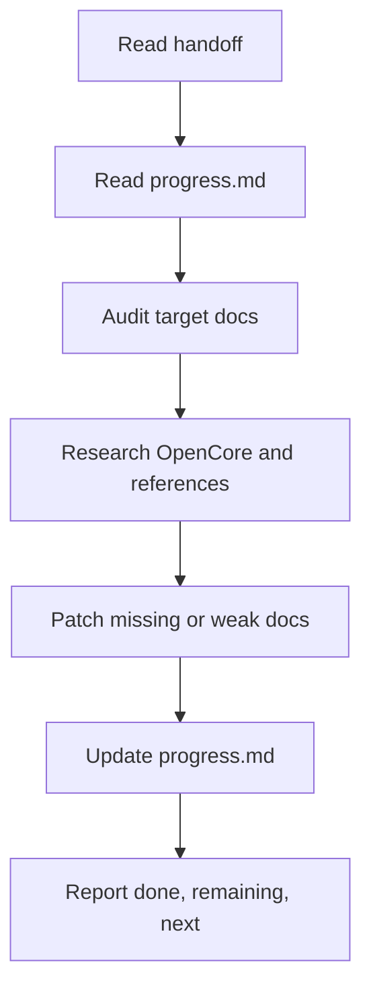

# OpenCore Strategy Blueprint

更新时间：2026-06-10

本目录是 OpenCore S3 前的战略蓝图文档包。它回答“OpenCore 最终要做成什么、API 和 Admin 会长成什么、哪些能力要做、哪些能力暂缓、旧项目经验如何复用、后续阶段怎么走”。本阶段只输出文档，不实现业务代码。

## 当前阶段边界

- 当前 OpenCore 已完成 S0/S1/D1-D6，并进入 S2 API/Admin 空主干。
- `apps/api` 当前只应保持 NestJS health 和 OpenAPI skeleton。
- `apps/admin` 当前只应保持 Umi Max + Ant Design Pro V6 空后台壳。
- 本战略包不代表已经实现登录、RBAC、数据库、业务模块、多租户、知识库、RAG、Agent、CRM、ERP、MES、WMS、商城、支付或会员。

## 推荐阅读顺序

| 顺序 | 文件                                                                 | 先回答的问题                                      |
| ---- | -------------------------------------------------------------------- | ------------------------------------------------- |
| 1    | [opencore-target-vision.md](opencore-target-vision.md)               | OpenCore 最终是什么，和 RuoYi/Yudao 是什么关系    |
| 2    | [ruoyi-yudao-capability-matrix.md](ruoyi-yudao-capability-matrix.md) | 对标后哪些模块做、哪些不做、哪些以后做            |
| 3    | [api-target-architecture.md](api-target-architecture.md)             | `apps/api` 最终模块层次和后端建设顺序             |
| 4    | [admin-page-map.md](admin-page-map.md)                               | `apps/admin` 最终一级菜单、页面地图和前端建设顺序 |
| 5    | [legacy-reuse-audit.md](legacy-reuse-audit.md)                       | NestWeb / Antdpro6 哪些经验可复用，哪些不迁移     |
| 6    | [staged-roadmap.md](staged-roadmap.md)                               | S3 到 S12 每阶段交付什么、不做什么、怎么验收      |
| 7    | [visual/opencore-blueprint.html](visual/opencore-blueprint.html)     | 给 owner 快速浏览的单文件可视化总览               |
| 8    | [progress.md](progress.md)                                           | 当前蓝图包完成度、每轮 Codex 摘要、下一轮建议     |

## 哪些文件回答哪些问题

| 问题                                                                                         | 入口                                                                         |
| -------------------------------------------------------------------------------------------- | ---------------------------------------------------------------------------- |
| OpenCore Lite / Full / AI Native Edition 怎么分                                              | [目标愿景](opencore-target-vision.md#opencore-lite--full--ai-native-edition) |
| 为什么学习 RuoYi/Yudao 但不复制 Java/Vue                                                     | [目标愿景](opencore-target-vision.md#与-ruoyiyudao-的关系)                   |
| RuoYi/Yudao 的 system、infra、workflow、report 等怎么映射                                    | [能力矩阵](ruoyi-yudao-capability-matrix.md)                                 |
| 后端 core / monitor / tool / collaboration / optional / industry / integration / ai 如何落地 | [API 蓝图](api-target-architecture.md#模块层级如何落地)                      |
| 后台一级菜单和页面如何规划                                                                   | [Admin 页面蓝图](admin-page-map.md#最终一级菜单设计)                         |
| NestWeb 的 Role.code、OpenAPI drift、runtime config 等如何复用                               | [旧项目复用审计](legacy-reuse-audit.md)                                      |
| S3 之后先做 contracts 还是 RBAC                                                              | [分阶段路线图](staged-roadmap.md)                                            |

## 调研基线

本包基于以下本地仓库状态形成：

| 仓库                | 本地路径                               | 参考点                                                                                           |
| ------------------- | -------------------------------------- | ------------------------------------------------------------------------------------------------ |
| Gan-Xing/OpenCore   | `/home/ubuntu/dev/opencore`            | S2 API/Admin 空主干与现有 docs                                                                   |
| Gan-Xing/NestWeb    | `/home/ubuntu/dev/NestWeb`             | commit `d6968d2`，后端 RBAC、OpenAPI、运行时、安全、日志、文件、消息、Approval Lite              |
| Gan-Xing/Antdpro6   | `/home/ubuntu/dev/Antdpro6`            | commit `faa62c8`，Umi/Ant Design Pro 页面、access、request、OpenAPI service、ProTable、E2E、导出 |
| RuoYi/Yudao backend | `/home/ubuntu/dev/ruoyi-vue-pro`       | commit `51b3d2d8cd`，system/infra/业务模块地图、精简版/完整版思路                                |
| Yudao Vue3 Admin    | `/home/ubuntu/dev/yudao-ui-admin-vue3` | commit `caa6fa9b`，Vue3 Admin 菜单与页面组织参考                                                 |

## 后续 Codex 循环规则

每轮继续本 goal 时必须：

1. 先读 `docs/handoff/2026-06-10-strategy-blueprint-goal-handoff.md`。
2. 再读 [progress.md](progress.md)。
3. 检查目标文件是否缺失或质量不足。
4. 只补未完成或质量不足的文档。
5. 不写业务代码、不改 schema、不实现登录/RBAC/数据库。
6. 更新 [progress.md](progress.md)。
7. 输出完成项、未完成项、下一轮建议。

