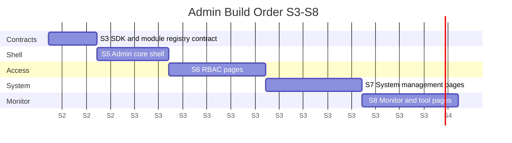

# Admin Page Map

更新时间：2026-06-10

`apps/admin` 的最终形态是 OpenCore 官方后台中台。它使用 Umi Max + Ant Design Pro V6 + ProComponents v3 + antd 6 + React 19。页面必须由模块注册表、权限码和 OpenAPI SDK 驱动，不能先手写孤立页面。

## Admin Menu Tree

```mermaid
flowchart TD
  ROOT[OpenCore Admin] --> DASH[Dashboard]
  ROOT --> SYSTEM[System]
  ROOT --> SECURITY[Security and Access]
  ROOT --> MONITOR[Monitor]
  ROOT --> TOOL[Tools]
  ROOT --> COLLAB[Collaboration]
  ROOT --> TPL[Templates and Examples]
  ROOT --> OPTIONAL[Optional Modules]
  ROOT --> PROFILE[Profile]
  SYSTEM --> USERS[Users]
  SYSTEM --> ROLES[Roles]
  SYSTEM --> PERMS[Permissions]
  SYSTEM --> MENUS[Menus]
  SYSTEM --> DICTS[Dicts]
  SYSTEM --> CONFIG[System Config]
  SYSTEM --> FILES[File Center]
  SECURITY --> LOGINLOG[Login Logs]
  SECURITY --> AUDIT[Operation Logs]
  MONITOR --> STATUS[System Status]
  MONITOR --> VERSION[Version]
  MONITOR --> QUEUES[Queues]
  MONITOR --> CACHE[Cache]
  TOOL --> OPENAPI[OpenAPI]
  TOOL --> FORGE[OpenForge]
  TOOL --> EXPORT[Export Tools]
  COLLAB --> MSG[Message Center]
  COLLAB --> APPROVAL[Approval Lite]
  TPL --> LIST[List Template]
  TPL --> FORM[Form Template]
  TPL --> DETAIL[Detail Template]
  TPL --> RESULT[Result Pages]
  TPL --> EXCEPTION[Exception Pages]
  TPL --> AIASSIST[AI Assistant Template]
```

## 最终一级菜单设计

| 一级菜单               | 页面                                                    | 对标来源                                                 | OpenCore 层级                     | 第一阶段实现 | 后续状态          |
| ---------------------- | ------------------------------------------------------- | -------------------------------------------------------- | --------------------------------- | ------------ | ----------------- |
| Dashboard              | 概览、健康、快捷入口、最近日志摘要                      | Antdpro6 Dashboard、Ant Design Pro Dashboard             | core / monitor                    | yes          | Lite 默认         |
| System                 | 用户、角色、权限、菜单、字典、系统参数、文件中心        | RuoYi/Yudao system，Antdpro6 Auth/System                 | core                              | yes          | Lite 默认         |
| Security and Access    | 登录日志、操作日志、权限审计、账号安全                  | NestWeb security baseline、Antdpro6 Security/LoginLogs   | core / monitor                    | yes          | Lite 默认         |
| Monitor                | 系统状态、版本、队列、缓存、在线用户、任务日志          | RuoYi/Yudao infra/monitor，Antdpro6 System/Status/Queues | monitor                           | partial      | 部分 S8，部分 S12 |
| Tools                  | OpenAPI、SDK 状态、OpenForge、导入导出工具              | RuoYi/Yudao codegen/swagger，NestWeb OpenAPI             | tool                              | partial      | S3/S8/S9          |
| Collaboration          | 消息中心、待办、Approval Lite、通知公告                 | NestWeb/Antdpro6 messages/approval，Yudao notify/BPM     | collaboration                     | yes          | S10               |
| Templates and Examples | 列表、表单、详情、结果、异常、个人页、AI Assistant 模板 | Ant Design Pro 模板                                      | experimental                      | no           | 只保留为 examples |
| Optional Modules       | Workflow、Report、Integration、Industry preview         | RuoYi/Yudao bpm/report/mp/pay/industry                   | optional / integration / industry | no           | 默认关闭          |
| Profile                | 个人资料、修改密码、账号安全                            | Antdpro6 Account/Profile，Yudao Profile                  | core                              | yes          | RBAC 后启用       |

## 页面清单

| 页面          | 路径建议                           | 权限码建议                    | 来源参考                                           | 阶段 | 说明                                |
| ------------- | ---------------------------------- | ----------------------------- | -------------------------------------------------- | ---- | ----------------------------------- |
| Dashboard     | `/dashboard`                       | `core:dashboard:read`         | Antdpro6 `Dashboard/index.tsx`                     | S5   | 先展示 health 和空状态，后续接指标  |
| 用户管理      | `/system/users`                    | `core:user:read`              | RuoYi/Yudao system/user，Antdpro6 Auth/Users       | S6   | RBAC 闭环核心页面                   |
| 角色管理      | `/system/roles`                    | `core:role:read`              | RuoYi/Yudao system/role，Antdpro6 Auth/Roles       | S6   | 使用 `Role.code` 稳定身份           |
| 权限管理      | `/system/permissions`              | `core:permission:read`        | RuoYi/Yudao permission，Antdpro6 Auth/Permissions  | S6   | 权限码从 module registry 生成或校验 |
| 菜单管理      | `/system/menus`                    | `core:menu:read`              | RuoYi/Yudao menu，Antdpro6 Auth/Menus              | S6   | 菜单 key/path/permission 可追踪     |
| 字典管理      | `/system/dicts`                    | `core:dict:read`              | RuoYi/Yudao dict，Antdpro6 System/Dicts            | S7   | 第一批系统 CRUD                     |
| 系统参数      | `/system/config`                   | `core:config:read`            | RuoYi/Yudao config，Antdpro6 System/Config         | S7   | 不存密钥，只做安全白名单参数        |
| 文件中心      | `/system/files`                    | `core:file:read`              | Yudao infra/file，Antdpro6 System/Files            | S7   | 通用文件资产，不做工程图片业务      |
| 登录日志      | `/security/login-logs`             | `core:login-log:read`         | RuoYi/Yudao loginLog，Antdpro6 Security/LoginLogs  | S7   | 登录实现后接入                      |
| 操作日志      | `/security/operation-logs`         | `core:audit-log:read`         | RuoYi/Yudao operatelog，Antdpro6 System/SystemLogs | S7   | 与 API 审计模型绑定                 |
| 系统状态      | `/monitor/status`                  | `monitor:status:read`         | Antdpro6 System/Status                             | S8   | 数据库、Redis、队列、对象存储诊断   |
| 版本信息      | `/monitor/version`                 | `monitor:version:read`        | Antdpro6 System/Version                            | S8   | 版本、commit、build time            |
| 队列监控      | `/monitor/queues`                  | `monitor:queue:read/manage`   | Antdpro6 System/Queues                             | S8   | BullMQ 指标、暂停与恢复             |
| 缓存监控      | `/monitor/cache`                   | `monitor:cache:read`          | Yudao infra/redis                                  | S12  | Redis 接入稳定后做                  |
| 在线用户      | `/monitor/online-users`            | `monitor:online-user:read`    | RuoYi/Yudao online user                            | S12  | session 模型稳定后做                |
| OpenAPI 状态  | `/tools/openapi`                   | `tool:openapi:read`           | NestWeb OpenAPI workflow                           | S8   | 展示契约导出和 SDK drift 状态       |
| OpenForge     | `/tools/openforge`                 | `tool:openforge:read`         | Yudao codegen                                      | S9   | MVP 先做 dry-run 和 diff plan       |
| 导出工具      | `/tools/export`                    | `tool:export:read`            | Antdpro6 TableExportButton                         | S9   | 当前页导出模式沉淀为模板            |
| 消息中心      | `/collaboration/messages`          | `collaboration:message:read`  | NestWeb/Antdpro6 MessageCenter                     | S10  | 通知和待办                          |
| Approval Lite | `/collaboration/approval-requests` | `collaboration:approval:read` | NestWeb/Antdpro6 Approvals/Requests                | S10  | 单步审批，不做流程引擎              |
| 通知公告      | `/collaboration/notices`           | `collaboration:notice:read`   | Yudao notice/notify                                | S12  | 消息中心稳定后做                    |
| 个人页        | `/account/profile`                 | `core:profile:read`           | Antdpro6 Account/Profile                           | S6   | 登录后启用                          |
| 403/404/500   | `/403`、`/404`、`/500`             | none                          | Ant Design Pro exception                           | S5   | 模板能力，正式保留                  |

## Ant Design Pro 模板来源处理

| 模板能力     | 处理方式                                                                 |
| ------------ | ------------------------------------------------------------------------ |
| Dashboard    | 进入正式菜单，先显示 health、系统摘要、快捷入口                          |
| 表单         | 作为 `Templates and Examples`，OpenForge 后续生成 ModalForm / DrawerForm |
| 列表         | 作为 ProTable 模板，驱动用户、角色、字典、日志等页面                     |
| 详情         | 作为 ProDescriptions / Drawer 详情模板                                   |
| 结果页       | 保留为 examples，业务流程需要时再挂正式路由                              |
| 异常页       | 403/404/500 保留正式路由                                                 |
| 个人页       | 登录/RBAC 后进入正式页面                                                 |
| AI Assistant | 只保留模板和设计位，第一年不做 AI 业务                                   |

## 从 Antdpro6 可复用的前端经验

| 经验                   | OpenCore 处理                                                             |
| ---------------------- | ------------------------------------------------------------------------- |
| Umi 路由和 access 绑定 | 保留 access 层，但权限码统一到 `<module>:<resource>:<action>`             |
| request 错误处理       | 迁移思路：统一 baseURL、错误提示、401/403 处理、语言 header、trace header |
| OpenAPI service 生成   | 改成从 `packages/sdk` 或 SDK 约束 request 层消费                          |
| ProTable 页面结构      | 用户、角色、字典、日志、消息等页面可复用交互模式                          |
| TableExportButton      | 保留“当前页 CSV 导出”作为 Lite 能力，大数据异步导出后置                   |
| Playwright E2E         | 保留关键路径 E2E，先覆盖 shell、权限、列表、导出、消息审批                |
| Dashboard summary      | 保留健康、指标、最近日志、快捷入口模式                                    |

## 推荐 S3-S8 前端建设顺序

| 阶段 | 前端目标                                                            |
| ---- | ------------------------------------------------------------------- |
| S3   | 确认 Admin 只消费 SDK、module-registry、权限码，不手写漂移类型      |
| S5   | Dashboard、Layout、错误页、空状态、菜单来源接口或静态 registry mock |
| S6   | 用户、角色、权限、菜单、个人页、access 规则                         |
| S7   | 字典、系统参数、文件中心、登录日志、操作日志                        |
| S8   | 系统状态、版本、队列、OpenAPI drift、导出模板                       |

## 非目标

- 不使用 Vue，不移植 Yudao UI 代码。
- 不使用 Refine，不把 MUI 作为官方 Admin。
- 不在 S5-S8 做商城、CRM、ERP、MES、WMS、支付、会员、多租户。
- 不在 S5-S8 做知识库、RAG、Agent。
