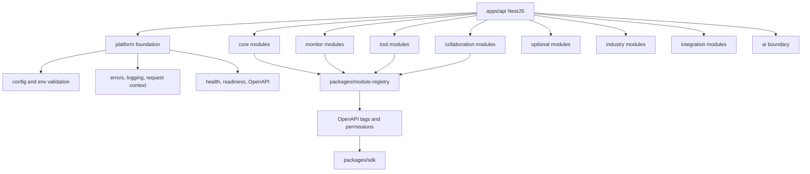
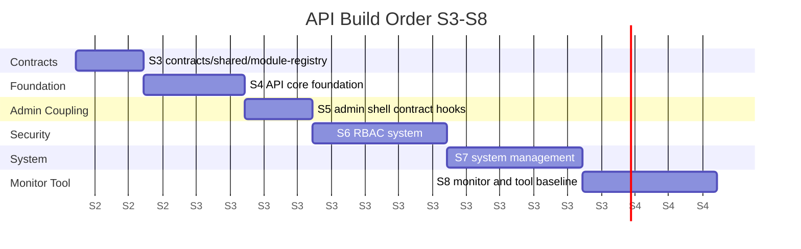

# API Target Architecture

更新时间：2026-06-10

`apps/api` 的最终目标是成为 OpenCore 的后端契约源头，而不是普通 CRUD 堆叠目录。模块必须先进入 module registry，再进入 Controller / Service / DTO / Entity / OpenAPI tag。S3-S8 前不应跳过契约、共享类型和权限码标准直接写业务。

## API Module Layers



## 最终模块目录结构

这是目标结构，不是本轮要创建的业务代码。

```text
apps/api/src/
  main.ts
  app/
    app.module.ts
    health.controller.ts
  platform/
    config/
    errors/
    logging/
    request-context/
    openapi/
    security/
  modules/
    core/
      users/
      roles/
      permissions/
      menus/
      dicts/
      system-config/
      files/
      audit-logs/
      login-logs/
    monitor/
      status/
      version/
      queues/
      jobs/
      cache/
      online-users/
      api-access-logs/
      api-error-logs/
    tool/
      openapi/
      openforge/
      table-export/
      import-export/
    collaboration/
      messages/
      approval-lite/
      notices/
    optional/
      workflow/
      report/
      form-builder/
    integration/
      mail/
      sms/
      wechat/
      oauth/
      pay/
    industry/
      crm/
      erp/
      mes/
      wms/
      mall/
      iot/
    ai/
      providers/
      prompts/
      tools/
      audit/
      cost/
```

## 模块层级如何落地

| 层级 | API 责任 | 示例 Controller | 示例 Service | 示例 DTO / Entity | OpenAPI tag | 第一阶段策略 |
| --- | --- | --- | --- | --- | --- | --- |
| `core` | 平台运行必需能力 | `UsersController`、`RolesController`、`DictsController`、`FilesController` | `UsersService`、`RolesService`、`DictsService`、`FilesService` | `UserDto`、`RoleDto`、`DictTypeDto`、`FileAssetEntity` | `Core Users`、`Core Roles`、`Core Dicts`、`Core Files` | S4-S7 逐步做 |
| `monitor` | 运维和诊断能力 | `StatusController`、`QueuesController`、`ApiLogsController` | `StatusService`、`QueueMonitorService`、`ApiLogService` | `SystemStatusDto`、`QueueStatusDto`、`ApiLogEntity` | `Monitor Status`、`Monitor Queue`、`Monitor Logs` | S8 做只读和基础诊断 |
| `tool` | 开发平台工具 | `OpenApiController`、`OpenForgeController` | `OpenApiExportService`、`OpenForgePlanService` | `GeneratePlanDto`、`ContractDiffDto` | `Tool OpenAPI`、`Tool OpenForge` | S3/S9 做基线和 MVP |
| `collaboration` | 消息、待办、轻审批 | `MessagesController`、`ApprovalLiteController` | `MessagesService`、`ApprovalLiteService` | `MessageDto`、`ApprovalRequestDto` | `Collaboration Messages`、`Collaboration Approval Lite` | S10 做 |
| `optional` | 通用可选能力 | `WorkflowController`、`ReportController` | `WorkflowService`、`ReportService` | `WorkflowDefinitionDto`、`ReportDatasetDto` | `Optional Workflow`、`Optional Report` | 只做设计位 |
| `integration` | 第三方接入 | `MailController`、`SmsController`、`WechatController` | `MailService`、`SmsService`、`WechatService` | `ProviderConfigDto`、`SendMessageDto` | `Integration Mail`、`Integration Sms` | S12 后评估 |
| `industry` | 行业模块 | `CrmController`、`ErpController`、`MesController` | 独立行业 Service | 行业 DTO / Entity | `Industry CRM` 等 | 不进入 core |
| `ai` | AI Native 边界 | `AiProviderController`、`PromptController` | `AiProviderService`、`PromptAuditService` | `ModelProviderDto`、`PromptTemplateDto` | `AI Providers`、`AI Audit` | 只预留，不做 RAG/Agent |

## Controller / Service / DTO / Entity 约定

| 资产 | 约定 | 目的 |
| --- | --- | --- |
| Controller | 只暴露 HTTP 边界、OpenAPI decorator、权限 decorator | 防止业务逻辑散落在路由层 |
| Service | 承载业务规则、事务、权限辅助检查、与外部 provider 交互 | 便于单元测试和复用 |
| DTO | 输入输出必须明确，分页、排序、过滤使用统一结构 | OpenAPI 和 SDK 稳定 |
| Entity | 输出实体只表达 API 响应，不直接泄漏 ORM 内部模型 | 降低 Prisma schema 变更对 API 的影响 |
| OpenAPI tag | 按层级和资源命名，例如 `Core Users` | SDK 命名可读，Admin 页面可追踪 |
| Permission code | 使用 `<module>:<resource>:<action>` | 与 module registry 和 Admin access 对齐 |

## 从 NestWeb 可复用的后端经验

| 经验 | NestWeb 证据 | OpenCore 转译 |
| --- | --- | --- |
| `Role.code` 是稳定身份 | `/home/ubuntu/dev/NestWeb/docs/permission-model.md` 明确 `Role.code` 保护 admin | OpenCore 保留 `Role.code`，禁止用展示名判断权限 |
| 权限 guard 模式 | `src/common/guards/permissions.guard.ts` | 后续用 decorator + guard，但权限码格式改成 OpenCore 标准 |
| OpenAPI drift check | `pnpm run openapi:generate` 和 `openapi:check` | S3 建立 `apps/api` 导出、contracts 保存、SDK 生成、diff 检查 |
| runtime config fail fast | `docs/security-baseline.md` | S4 建立环境变量 schema、生产密钥检查、CORS 明确配置 |
| 安全基线 | helmet、禁用 x-powered-by、生产 Swagger 受控、metrics 私有 | S4 平台基础统一引入 |
| 日志和脱敏 | system-log / logging interceptor | S4-S8 建立审计日志、API 日志和敏感字段脱敏 |
| 文件中心 | files/storage/minio | S7 做 core file，不把图片资源业务放入 core |
| 消息和 Approval Lite | messages / approval-requests | S10 做协同基础，不做完整工作流 |
| 队列和系统状态 | queue、redis、system/status | S8 做 monitor 只读诊断 |

## 只借鉴不迁移的旧代码

| 旧代码/模块 | 判断 |
| --- | --- |
| `articles` | 不进入 core，可作为 experimental 或示例内容模块 |
| `images` 工程图片资源 | 不进入 core；可归到 `industry` 或 `experimental`，文件中心只保留通用 file asset |
| `wechat` | 不进入 core，归 `integration.wechat`，凭据和消息回调后置 |
| `sms` / `email` | 不进入 core，归 integration，涉及 provider、成本和合规 |
| Prisma schema 和 migrations | 不迁移；OpenCore 后续重新设计 schema |
| NestWeb 前后端权限码格式 | 可学习稳定性，但格式统一到 OpenCore `<module>:<resource>:<action>` |
| RabbitMQ 细节 | OpenCore 主线倾向 Redis/BullMQ，RabbitMQ 只作为 integration/optional 评估 |

## 推荐 S3-S8 后端建设顺序



| 阶段 | 后端目标 |
| --- | --- |
| S3 | 建立 `packages/contracts`、`packages/shared`、`packages/module-registry`，定义 OpenAPI 导出和 SDK 生成协议 |
| S4 | 配置、环境变量校验、统一错误、日志、request id、health/readiness、OpenAPI 基线 |
| S5 | 提供 Admin 壳层需要的契约 mock 或静态模块注册表，不做真实登录 |
| S6 | 实现 auth/RBAC 的最小闭环：user、role、permission、menu、access contract |
| S7 | 实现 dict、system config、file、audit log、login log |
| S8 | 实现 status、version、queue、OpenAPI drift check、table export 协议 |

## 非目标

- S3-S8 不做 CRM、ERP、MES、WMS、商城、支付、会员、多租户。
- S3-S8 不做知识库、RAG、Agent。
- S3-S8 不迁移 NestWeb 的 schema 或业务模块。
- S3-S8 不让 Admin 手写裸 API 类型绕过 SDK。
