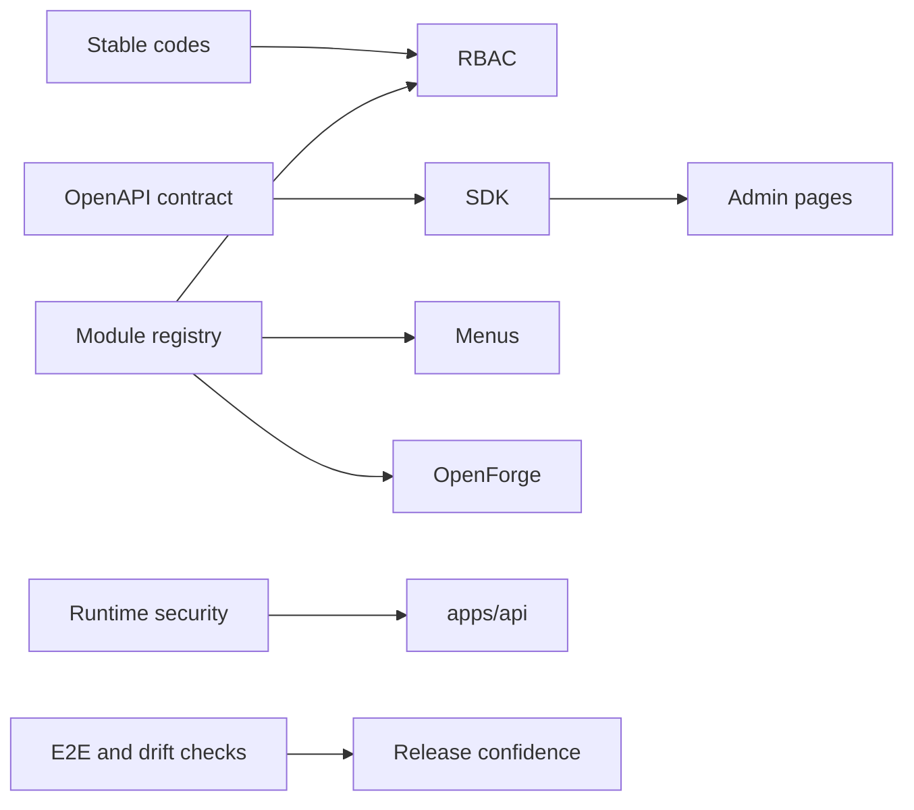

# Legacy Reuse Audit

更新时间：2026-06-10

本审计覆盖旧后端 Gan-Xing/NestWeb（`/home/ubuntu/dev/NestWeb`）和旧前端 Gan-Xing/Antdpro6（`/home/ubuntu/dev/Antdpro6`）。结论是：复用设计经验、测试习惯和工程纪律，不直接迁移业务代码、schema、路由和页面。

## 总体结论

| 旧项目   | 可复用价值                                                                                                  | OpenCore 处理                                                    |
| -------- | ----------------------------------------------------------------------------------------------------------- | ---------------------------------------------------------------- |
| NestWeb  | RBAC、`Role.code`、OpenAPI drift、runtime config、安全基线、文件、日志、消息、Approval Lite、队列、系统状态 | 重写到 OpenCore 架构，保留经验和验收规则                         |
| Antdpro6 | Umi/Ant Design Pro 实践、access、request、OpenAPI service、ProTable、TableExportButton、Dashboard、E2E      | 迁移交互和工程模式，代码按 React 19/antd 6/ProComponents v3 重写 |

## 直接可迁移的经验

| 经验                       | 来源                                                                        | 迁移方式                                                         |
| -------------------------- | --------------------------------------------------------------------------- | ---------------------------------------------------------------- |
| `Role.code` 是稳定系统身份 | NestWeb `docs/permission-model.md`                                          | OpenCore RBAC 必须以 `Role.code` 和 `Permission.code` 为稳定字段 |
| 权限码不等于菜单文案       | NestWeb permission model，Antdpro6 access                                   | OpenCore 权限码统一使用 `<module>:<resource>:<action>`           |
| OpenAPI drift check        | NestWeb `openapi:generate` / `openapi:check`，Antdpro6 `openapi:nest:check` | S3 建立 API 导出、contracts、SDK、diff 检查                      |
| 运行时配置 fail fast       | NestWeb security baseline                                                   | S4 建立 env schema，生产密钥和 CORS 检查                         |
| Swagger/OpenAPI 生产可控   | NestWeb security baseline                                                   | 生产默认关闭或受控开放                                           |
| 日志脱敏                   | NestWeb logging/system-log interceptor                                      | S4/S7 设计敏感字段脱敏规则                                       |
| 当前页 CSV 导出            | Antdpro6 TableExportButton                                                  | S8/S9 转成 OpenCore 表格模板能力                                 |
| E2E 覆盖关键业务链路       | Antdpro6 Playwright                                                         | OpenCore 先覆盖 shell、RBAC、导出、消息审批                      |
| 文档和 handoff 结构        | NestWeb docs/handoff                                                        | OpenCore 保留阶段 handoff；`progress.md` 只做压缩状态索引        |

## 需要重写但可参考的模块

| 模块               | 旧项目状态                                                      | OpenCore 目标                              | 重写原因                                        |
| ------------------ | --------------------------------------------------------------- | ------------------------------------------ | ----------------------------------------------- |
| RBAC               | NestWeb 有 users/roles/permissions/menus，Antdpro6 有 Auth 页面 | S6 做 `core.user/role/permission/menu`     | 权限码格式、module registry 和 SDK 链路不同     |
| Dashboard summary  | Antdpro6 有 Dashboard，NestWeb 有 dashboard summary             | S5/S8 做 OpenCore Dashboard                | 指标来源和模块状态要按 OpenCore registry 重建   |
| 文件中心           | NestWeb files/storage/minio，Antdpro6 System/Files              | S7 做 `core.file`                          | 不迁移图片/工程资源业务，只保留通用文件资产     |
| 字典/系统参数      | NestWeb dicts/system-config，Antdpro6 System/Dicts/Config       | S7 做 `core.dict` 和 `core.config`         | 配置安全边界需要重定                            |
| 登录日志/操作日志  | NestWeb login-logs/system-log，Antdpro6 Security/SystemLogs     | S7 做 `core.login-log` 和 `core.audit-log` | 与 OpenCore auth 和 request context 绑定        |
| 系统状态/版本/队列 | NestWeb system/queue/redis，Antdpro6 Status/Version/Queues      | S8 做 `monitor.status/version/queue`       | Redis/BullMQ/MinIO 依赖需要按 OpenCore 选型重接 |
| 消息中心           | NestWeb messages，Antdpro6 MessageCenter                        | S10 做 `collaboration.message`             | 保留通知/待办模型，权限和 SDK 重写              |
| Approval Lite      | NestWeb approval-requests，Antdpro6 Approvals/Requests          | S10 做 `collaboration.approval-lite`       | 只保留单步审批，不引入完整流程引擎              |
| request 层         | Antdpro6 requestErrorConfig                                     | S5/S6 建统一 SDK request                   | 旧代码基于旧 API 和 token 流程，需要重写        |

## 不建议迁移的模块

| 旧模块                             | 判断       | 原因                                                               |
| ---------------------------------- | ---------- | ------------------------------------------------------------------ |
| Prisma schema / migrations         | 不迁移     | OpenCore 不能被旧数据模型锁死                                      |
| `articles`                         | 不进 core  | 内容模块不是平台内核，可作为 example/experimental                  |
| `images` 工程图片                  | 不进 core  | 文件中心应是通用资产，工程图片是业务模块                           |
| 旧 auth/token 实现                 | 不直接迁移 | OpenCore S6 要基于新 security baseline 和模块注册表重建            |
| RabbitMQ 专用实现                  | 不直接迁移 | OpenCore 主线优先 Redis/BullMQ，RabbitMQ 后续作为 integration 评估 |
| 旧前端生成 service                 | 不直接迁移 | OpenCore 要通过 `packages/sdk` 管理                                |
| 旧 Antdpro6 React 18 / antd 5 代码 | 不直接迁移 | OpenCore 已锁 React 19、antd 6、ProComponents v3                   |

## 可作为 industry / integration / experimental 的模块

| 模块                | 建议归类                     | 说明                                             |
| ------------------- | ---------------------------- | ------------------------------------------------ |
| 工程图片 / `images` | `industry` 或 `experimental` | 不进入 core；如果 owner 需要行业演示，可独立挂载 |
| 微信                | `integration.wechat`         | 需要凭据、回调、安全、消息治理                   |
| 短信                | `integration.sms`            | 涉及供应商、成本、验证码安全                     |
| 邮件                | `integration.mail`           | 涉及模板、发信账号、日志和退信处理               |
| Article             | `experimental.article`       | 可作为 OpenForge 示例，不作为平台核心模块        |
| 大数据量导出        | `optional.export-job`        | 需要后端异步任务、文件中心、权限和过期策略       |

## 旧项目踩过的坑

| 坑                             | 影响                         | OpenCore 防线                          |
| ------------------------------ | ---------------------------- | -------------------------------------- |
| 角色显示名参与逻辑             | 改名会破坏权限               | 只用 `Role.code` 做系统身份            |
| OpenAPI 和前端 service 漂移    | 页面类型和接口实际返回不一致 | CI 导出 OpenAPI、生成 SDK、检查 diff   |
| 业务模块太早进入 core          | 平台内核变重，难以 Lite 化   | module registry 先定义层级和 edition   |
| 生产 Swagger/metrics 暴露      | 安全风险                     | 生产默认关闭或受控                     |
| 日志记录敏感数据               | token、密码、验证码泄漏      | logging interceptor 和审计脱敏规则     |
| 文件中心和图库混用             | core 被业务语义污染          | `core.file` 只做文件资产               |
| Approval Lite 向完整工作流膨胀 | 范围失控                     | S10 只做单步审批，workflow 放 optional |
| 前端直接写 API 类型            | SDK 失效                     | Admin 只能消费 SDK 或 SDK 约束 request |

## 重点审计清单

| 审计项                     | 旧项目结论                                 | OpenCore 结论                            |
| -------------------------- | ------------------------------------------ | ---------------------------------------- |
| Role.code                  | NestWeb 明确 `admin` / `user` code 稳定    | 必须保留，S6 核心验收                    |
| RBAC                       | 旧项目已有闭环                             | 重写，权限码和菜单来自 module registry   |
| OpenAPI drift check        | 后端和前端都有 check 脚本                  | S3 必须做成 CI 门禁                      |
| i18n check                 | NestWeb / Antdpro6 都有 `check-i18n.cjs`   | Admin 正式页面进入前保留 i18n 检查       |
| Dashboard summary          | Antdpro6 页面可参考                        | S5 先做壳，S8 接指标                     |
| runtime config             | NestWeb security baseline 成熟             | S4 先实现 env schema 和生产检查          |
| 文件中心                   | 旧项目可参考                               | S7 做 core file，不迁移 images 业务      |
| 字典/系统参数              | 旧项目可参考                               | S7 做系统管理                            |
| 登录日志/操作日志          | 旧项目可参考                               | S7 做审计基础                            |
| 系统状态/版本/队列         | 旧项目可参考                               | S8 做 monitor                            |
| 消息中心                   | 旧项目可参考                               | S10 做 collaboration                     |
| Approval Lite              | 旧项目边界清楚                             | S10 只做单步审批                         |
| TableExportButton          | 旧项目实现轻量                             | S8/S9 保留当前页导出                     |
| E2E                        | Antdpro6 已覆盖消息审批导出                | OpenCore 复制测试策略，不复制测试数据    |
| 文档结构                   | handoff、runbook、security baseline 有价值 | OpenCore 保留 handoff + progress         |
| 工程图片/微信/短信/Article | 都不是 core                                | 分别归 industry/integration/experimental |

## OpenCore 应保留的设计原则

- 稳定 code 优先于展示名。
- 契约优先于手写客户端。
- 模块注册表优先于页面和权限散落。
- 安全默认值优先于演示便利。
- Lite 边界优先于一次性大而全。
- 旧代码经验可复用，旧业务实现不迁移。
