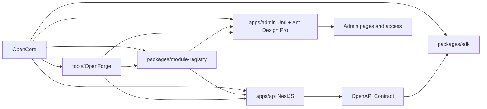
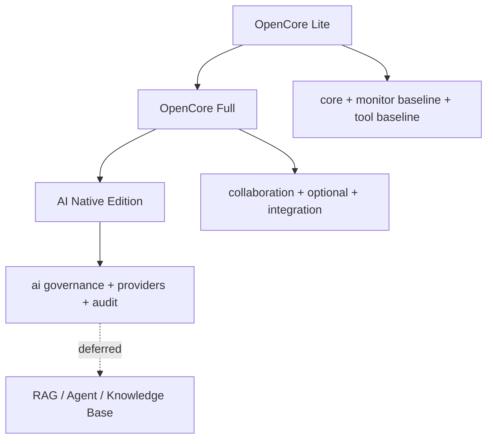

# OpenCore Target Vision

更新时间：2026-06-10

OpenCore 的最终形态是一个 AI Native 企业级全栈 Monorepo。它用 TypeScript 主线统一 API、官方 Admin、共享契约、SDK、模块注册表、OpenForge 代码生成器，以及后续 web/mobile/miniapp/desktop/AI 能力边界。OpenCore 不是 RuoYi/Yudao 的移植版，也不是旧项目 NestWeb/Antdpro6 的搬家工程。

## OpenCore 最终是什么

OpenCore 最终要成为三层能力组合：

| 层 | 目标 | 交付形态 |
| --- | --- | --- |
| 平台内核 | API、Admin、契约、权限码、菜单、模块注册表、配置、审计、文件、日志、健康检查 | `apps/api`、`apps/admin`、`packages/*` |
| 开发平台 | OpenAPI 到 SDK、OpenForge 生成器、模块启用规则、模板页面、E2E 基线 | `packages/contracts`、`packages/sdk`、`packages/module-registry`、`tools/OpenForge` |
| 扩展生态 | 协同、报表、工作流、集成、行业包、AI Native 能力 | `collaboration`、`optional`、`integration`、`industry`、`ai` |

OpenCore 的核心判断是：先把契约、模块注册表、权限码、菜单和工程边界做稳，再进入业务模块。否则后台页面、接口、SDK、权限和文档会快速漂移。

## OpenCore Platform Overview

## 与 RuoYi/Yudao 的关系

OpenCore 学习 RuoYi/Yudao 的产品组织经验，不复制技术实现。

| 学习对象 | 为什么学 | OpenCore 转译方式 | 不复制的内容 |
| --- | --- | --- | --- |
| 模块地图 | RuoYi/Yudao 把 system、infra、monitor、workflow、report、member、mall、pay、crm、erp、mes、wms、im、iot、ai 分得清楚 | 转译成 OpenCore 的 `core / monitor / tool / collaboration / optional / industry / integration / ai` 分层 | 不照搬 Java 多模块目录 |
| 权限粒度 | 菜单、按钮、API、数据权限的分层对后台很关键 | 用 `Permission.code`、`Role.code`、module registry、Admin access 统一 | 不复制 Spring Security / Vue 权限实现 |
| 代码生成器 | 代码生成器能把 CRUD、菜单、权限、接口文档连起来 | OpenForge 读取 OpenAPI、模块注册表、人工 schema 后生成 TypeScript 骨架 | 不复制 Java/Vue/SQL 模板 |
| 精简版/完整版 | 先有 Lite，后有 Full，避免平台被业务模块压垮 | Lite 只含 core/monitor/tool 基线，Full 才加 collaboration/optional/integration | 不把商城、ERP、MES、WMS 直接塞进 core |

RuoYi/Yudao 是参照系，不是目标代码库。OpenCore 的目标栈固定为 NestJS、Prisma、PostgreSQL、Redis、BullMQ、MinIO/S3、OpenAPI、Umi Max、Ant Design Pro V6、React 19、ProComponents v3、antd 6。

## OpenCore Lite / Full / AI Native Edition

| Edition | 边界 | 默认模块 | 明确不包含 |
| --- | --- | --- | --- |
| OpenCore Lite | 单团队或一人公司可运行的企业后台基线 | `core`、最小 `monitor`、最小 `tool`、OpenAPI/SDK/module-registry | CRM、ERP、MES、WMS、商城、支付、会员、多租户、RAG、Agent |
| OpenCore Full | 面向更完整企业应用的模块化发行 | Lite + `collaboration`、部分 `optional`、部分 `integration` | 行业深水区默认关闭，例如 ERP/MES/WMS |
| OpenCore AI Native Edition | 在权限、审计、成本、安全边界稳定后开放 AI 能力 | Full + `ai` 配置、模型供应商、Prompt、工具调用审计、成本治理 | 第一阶段不做知识库、RAG、Agent 实现 |

## apps/api 的核心职责

`apps/api` 是 OpenCore 的后端契约源头。最终职责包括：

- 暴露 OpenAPI contract，驱动 `packages/contracts` 和 `packages/sdk`。
- 按模块层级承载 Controller / Service / DTO / Entity。
- 统一配置、错误、日志、request id、健康检查、审计、权限守卫。
- 将模块权限、菜单、OpenAPI tag 与 `packages/module-registry` 对齐。
- 支撑 OpenForge 生成后端骨架，但不让生成器替代人工业务判断。

当前 S2 状态只包含 `/health/live`、`/health/ready` 和 `/api/docs` skeleton，不代表业务模块已开始。

## apps/admin 的核心职责

`apps/admin` 是 OpenCore 的官方后台。最终职责包括：

- 使用 Umi Max + Ant Design Pro V6 + ProComponents v3 + antd 6 + React 19。
- 从模块注册表消费菜单元数据，从 SDK 消费 API 类型。
- 使用 access 层消费权限码，不直接判断角色名。
- 提供 Dashboard、系统管理、监控工具、协同、模板示例和后续可选模块入口。
- 保留 Ant Design Pro 的表单、列表、详情、结果页、异常页、个人页、AI Assistant 等模板经验，但正式菜单只挂 OpenCore 自己的模块。

## 目标原则

| 原则 | 说明 |
| --- | --- |
| 契约先行 | 后端 OpenAPI、SDK、前端调用必须由同一契约链路驱动 |
| 模块注册表先行 | 模块、权限码、菜单、OpenAPI tag 先有元数据，再生成骨架 |
| Lite 先行 | 先完成系统/基础设施/监控/工具基线，再打开 Full 能力 |
| 旧项目经验复用 | 复用 NestWeb/Antdpro6 的设计经验，不直接迁移旧业务代码 |
| AI 延后 | AI Native 是产品定位，不是 S3-S8 的实现任务 |
