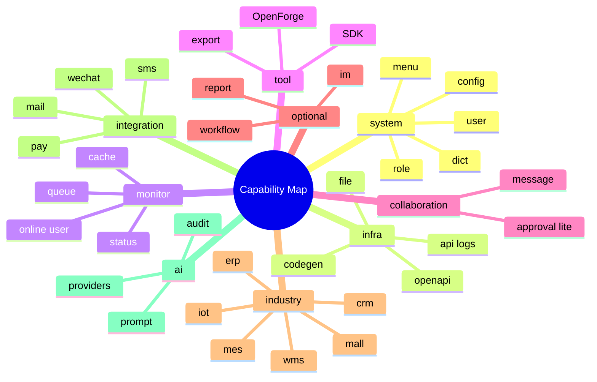

# RuoYi/Yudao Capability Matrix

更新时间：2026-06-10

本矩阵基于 `/home/ubuntu/dev/ruoyi-vue-pro` 和 `/home/ubuntu/dev/yudao-ui-admin-vue3` 的模块地图，并结合 OpenCore 当前 S2 状态、NestWeb、Antdpro6 旧项目经验做转译。矩阵只决定战略优先级，不实现模块。

## 状态与优先级

| 字段 | 取值说明 |
| --- | --- |
| 当前状态 | `done` 表示 OpenCore 已完成文档或空主干基线；`partial` 表示已有空壳或规范但未实现；`planned` 表示第一年应进入路线；`optional` 表示 Full 或后续版本可选；`not_now` 表示不进入当前 S3-S12 实现窗口，不等于永远不做 |
| 推荐优先级 | `P0` 契约和工程基线；`P1` core 基础；`P2` 系统管理和监控工具；`P3` 协同与生成器；`P4` 可选通用能力；`P5` 行业或深水区能力。P4/P5 必须进入长期 backlog 和模块准入规则，但不得抢占 S3-S8 |

## 大表格

| RuoYi/Yudao 模块名 | 模块分类 | OpenCore 对应模块 | OpenCore 层级 | 是否已有旧项目参考 | 当前状态 | 推荐优先级 | 是否进入 apps/api | 是否进入 apps/admin | 是否进入第一年路线 | 不做原因或延后原因 |
| --- | --- | --- | --- | --- | --- | --- | --- | --- | --- | --- |
| System 用户管理 | system | `core.user` | core | NestWeb / Antdpro6 | planned | P1 | yes | yes | yes | S6 前先完成 contracts、module-registry、权限码规范 |
| System 角色管理 | system | `core.role` | core | NestWeb / Antdpro6 | planned | P1 | yes | yes | yes | 必须保留 `Role.code` 稳定身份，不能先做 UI |
| System 权限/菜单 | system | `core.permission` / `core.menu` | core | NestWeb / Antdpro6 | planned | P1 | yes | yes | yes | 等 module-registry 和 access 标准落地后实现 |
| System 部门/岗位 | system | `core.org` / `core.post` | core | none | optional | P4 | yes | yes | no | 会引入组织树和数据权限，Lite 阶段不急 |
| System 字典 | system | `core.dict` | core | NestWeb / Antdpro6 | planned | P2 | yes | yes | yes | 适合作为系统管理第一批 CRUD |
| System 系统参数 | system | `core.config` | core | NestWeb / Antdpro6 | planned | P2 | yes | yes | yes | 需要 runtime config 边界，避免把密钥写入数据库 |
| System 登录日志 | system | `core.login-log` | core / monitor | NestWeb / Antdpro6 | planned | P2 | yes | yes | yes | 登录实现后再接入，S6 前只设计 |
| System 操作日志 | system | `core.audit-log` | core / monitor | NestWeb / Antdpro6 | planned | P2 | yes | yes | yes | 依赖统一拦截器和敏感字段脱敏 |
| System 站内信 | system | `collaboration.message` | collaboration | NestWeb / Antdpro6 | planned | P3 | yes | yes | yes | 先做通知/待办，不做复杂 IM |
| System 通知公告 | system | `collaboration.notice` | collaboration | none | optional | P4 | yes | yes | no | 可在消息中心稳定后补 |
| System 邮件 | system | `integration.mail` | integration | NestWeb | optional | P4 | yes | yes | no | 涉及供应商、模板和凭据治理 |
| System 短信 | system | `integration.sms` | integration | NestWeb | optional | P4 | yes | yes | no | 涉及供应商成本、合规和凭据治理 |
| System OAuth2 / SSO | system | `integration.oauth` | integration | none | optional | P4 | yes | yes | no | 登录/RBAC 稳定后再扩展 |
| System 租户/租户套餐 | system | `optional.tenant` | optional | none | not_now | P5 | no | no | no | 本阶段和第一年路线明确不做多租户 |
| System 地区/IP | system | `tool.area` / `integration.ip` | tool / integration | none | optional | P4 | yes | yes | no | 可作为辅助能力，不进入 core |
| Infra 代码生成 | infra | `tool.openforge` | tool | Antdpro6 service / RuoYi codegen | planned | P3 | yes | yes | yes | S9 做 MVP，只生成骨架，不生成业务逻辑 |
| Infra 系统接口 Swagger | infra | `tool.openapi` | tool | NestWeb / Antdpro6 | partial | P0 | yes | yes | yes | S2 已有 OpenAPI skeleton，S3 建契约链路 |
| Infra 文件服务 | infra | `core.file` | core / integration | NestWeb / Antdpro6 | planned | P2 | yes | yes | yes | 先做对象存储抽象和审计，不做图库业务 |
| Infra 文件配置 | infra | `core.file-config` | core / integration | NestWeb | optional | P4 | yes | yes | no | 可在文件中心稳定后加入 |
| Infra 配置管理 | infra | `core.config` | core | NestWeb / Antdpro6 | planned | P2 | yes | yes | yes | 与 System 系统参数合并规划 |
| Infra API 访问日志 | infra | `monitor.api-access-log` | monitor | NestWeb / Antdpro6 | planned | P2 | yes | yes | yes | 与操作日志共享审计模型 |
| Infra API 错误日志 | infra | `monitor.api-error-log` | monitor | NestWeb | planned | P2 | yes | yes | yes | 依赖统一异常过滤器和脱敏 |
| Infra 定时任务 | infra | `monitor.job` | monitor / tool | NestWeb queue | optional | P4 | yes | yes | no | BullMQ 基线后再做任务 UI |
| Infra 任务日志 | infra | `monitor.job-log` | monitor | NestWeb queue | optional | P4 | yes | yes | no | 与定时任务绑定推进 |
| Infra Redis 监控 | infra | `monitor.redis` | monitor | NestWeb redis | optional | P4 | yes | yes | no | 需要 Redis 接入稳定 |
| Infra Server 监控 | infra | `monitor.server` | monitor | NestWeb system status | planned | P2 | yes | yes | yes | Lite 可提供只读系统状态页 |
| Infra WebSocket | infra | `integration.websocket` | integration | none | optional | P4 | yes | yes | no | 消息中心先用普通 API，实时化后置 |
| Infra 数据源配置 | infra | `tool.datasource` | tool | none | not_now | P5 | no | no | no | 多数据源会提前扩大平台复杂度 |
| Infra demo 示例 | infra | `experimental.demo` | experimental | Ant Design Pro templates | optional | P4 | no | yes | no | 只能放 templates/examples，不进入正式模块 |
| Monitor 在线用户 | monitor | `monitor.online-user` | monitor | none | optional | P4 | yes | yes | no | 登录/RBAC/session 模型稳定后再做 |
| Monitor 缓存监控 | monitor | `monitor.cache` | monitor | NestWeb redis | optional | P4 | yes | yes | no | 依赖 Redis 连接和权限 |
| Monitor 队列监控 | monitor | `monitor.queue` | monitor | NestWeb / Antdpro6 | planned | P2 | yes | yes | yes | 可先做 BullMQ 只读诊断 |
| Monitor 版本/健康 | monitor | `monitor.status` / `monitor.version` | monitor | NestWeb / Antdpro6 | planned | P2 | yes | yes | yes | S2 已有 health，S8 扩到状态页 |
| Collaboration 消息中心 | collaboration | `collaboration.message` | collaboration | NestWeb / Antdpro6 | planned | P3 | yes | yes | yes | 通知和待办可复用旧项目边界 |
| Collaboration Approval Lite | collaboration | `collaboration.approval-lite` | collaboration | NestWeb / Antdpro6 | planned | P3 | yes | yes | yes | 只做单步审批，不做 Flowable/BPMN |
| Workflow BPM | workflow | `optional.workflow` | optional | NestWeb Approval Lite only | optional | P5 | no | no | no | 完整工作流太重，先保留设计位 |
| Report 报表设计器 | report | `optional.report` | optional | none | optional | P5 | no | no | no | 依赖数据模型、权限和导出能力成熟 |
| Member 会员中心 | member | `optional.member` | optional / industry | none | not_now | P5 | no | no | no | 本阶段明确不做会员 |
| Mall 商品 | mall | `industry.mall.product` | industry | none | not_now | P5 | no | no | no | 不进入 OpenCore core，未来独立行业包评估 |
| Mall 交易/促销 | mall | `industry.mall.trade` / `industry.mall.promotion` | industry | none | not_now | P5 | no | no | no | 商城复杂度高，明确不做 |
| Pay 应用/渠道/订单/退款 | pay | `integration.pay` | integration | none | not_now | P5 | no | no | no | 支付合规和资金链路后置 |
| CRM 客户/商机/合同 | crm | `industry.crm` | industry | none | not_now | P5 | no | no | no | 不做 CRM，未来独立 app/package 评估 |
| ERP 采购/销售/库存/财务 | erp | `industry.erp` | industry | none | not_now | P5 | no | no | no | 不做 ERP，避免污染平台内核 |
| MES 生产/质检/设备 | mes | `industry.mes` | industry | none | not_now | P5 | no | no | no | 不做 MES，属于行业深水区 |
| WMS 仓储/库存/订单 | wms | `industry.wms` | industry | none | not_now | P5 | no | no | no | 不做 WMS，未来行业版独立评估 |
| IM 即时通讯 | im | `optional.im` / `integration.websocket` | optional / integration | none | not_now | P5 | no | no | no | 先做消息中心，不做实时聊天 |
| IoT 设备/规则/告警 | iot | `industry.iot` | industry | none | not_now | P5 | no | no | no | 设备接入和规则引擎不属于第一年 |
| AI Chat/Image/Knowledge/Workflow | ai | `ai.*` | ai | none | not_now | P5 | no | no | no | 只做 AI Native 架构预留，不做知识库/RAG/Agent |
| MP 微信公众号 | integration | `integration.wechat` | integration | NestWeb wechat | optional | P4 | yes | yes | no | 可作为 integration，不进入 core |
| OpenAPI SDK 生成 | tool | `tool.openapi-sdk` | tool | NestWeb / Antdpro6 | planned | P0 | yes | yes | yes | S3 必须建立，防止接口和前端漂移 |
| Table Export 当前页导出 | tool | `tool.table-export` | tool | Antdpro6 | planned | P3 | no | yes | yes | 先做前端当前页导出，大数据异步导出后置 |

## 分类覆盖检查

## 第一年建议边界

第一年只建议进入 `P0-P3`：

- `P0`：contracts、shared、module-registry、OpenAPI/SDK 基线。
- `P1`：user、role、permission、menu 的 RBAC 系统。
- `P2`：dict、config、file、audit log、login log、status、version、queue。
- `P3`：OpenForge MVP、message center、Approval Lite、TableExportButton 模式。

`P4-P5` 只保留设计位，不进入第一年实现；这是一种阶段排序，不是产品放弃。

## P4/P5 长期覆盖承诺

OpenCore 的长期目标应是覆盖 RuoYi/Yudao 的企业后台能力地图。为了防止 `not_now` 被误读成“永不做”，P4/P5 统一按以下方式进入 backlog：

| 队列 | 覆盖能力 | 进入条件 | 默认形态 |
| --- | --- | --- | --- |
| P4 optional | 部门/岗位、通知公告、OAuth2、缓存、在线用户、定时任务、报表设计位、工作流设计位 | S6 RBAC、S7 审计、S8 监控工具稳定后 | `optional/*` 或 `monitor/*` 模块，可关闭 |
| P4 integration | 邮件、短信、微信、WebSocket、OAuth、文件 provider 扩展 | provider 凭据、回调安全、成本和审计规则明确后 | `integration/*` 包，不进入 core |
| P5 business platform | member、mall、pay、CRM、ERP、MES、WMS、IoT、IM、AI Knowledge/RAG/Agent | 有独立行业建模、权限、数据隔离、计费/合规和测试计划后 | `industry/*`、`ai/*` 或独立 app/package |

P4/P5 转入实现前必须补齐：

1. 模块准入文档：为什么进入、面向谁、默认是否启用。
2. OpenAPI tag、权限码、菜单、SDK、E2E 测试计划。
3. 数据模型边界：是否影响 core schema，是否需要迁移策略。
4. 安全与合规：凭据、支付、会员、行业数据、AI 成本与审计。
5. 退出策略：如果模块未成熟，如何回滚为 experimental/optional。

这样可以保证“若依/芋道有的能力，OpenCore 都有长期归宿”，同时避免 S3-S8 被 P5 深水区拖垮。
