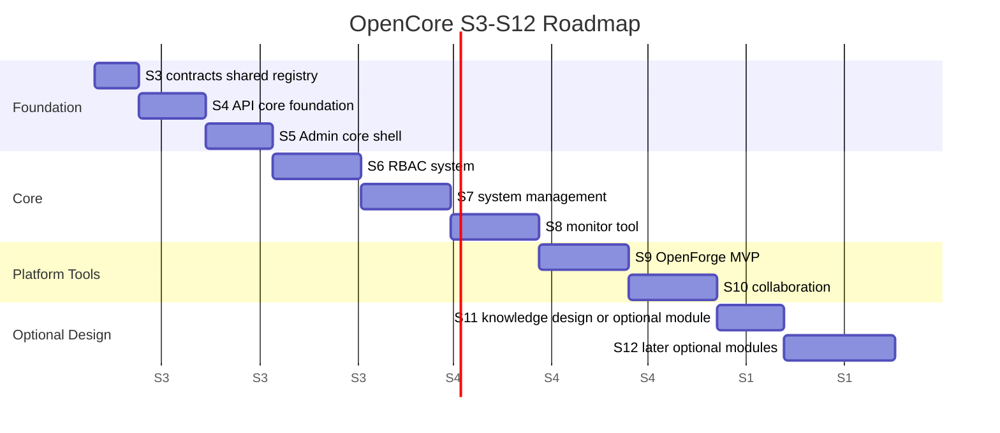
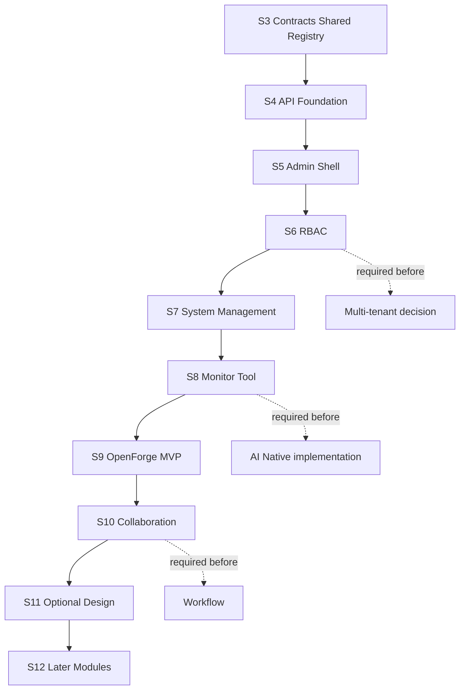

# Staged Roadmap

更新时间：2026-06-10

本路线图从 S3 开始。S0/S1/D1-D6 已完成文档和 monorepo 基线，S2 已初始化 `apps/api` 和 `apps/admin` 空主干。后续不能跳过 S3 直接写业务模块。

## Roadmap Overview

## 阶段详情

| 阶段 | 目标 | 新增模块 | 后端交付 | 前端交付 | 文档交付 | 验收标准 | 不做什么 | 风险点 |
| --- | --- | --- | --- | --- | --- | --- | --- | --- |
| S3 contracts/shared/module-registry 基线 | 建立契约、共享类型、模块注册表的单一事实来源 | `packages/contracts`、`packages/shared`、`packages/module-registry` | OpenAPI 导出命令、契约保存规范、权限码/菜单 schema 草案 | Admin 读取静态 registry 或 mock，不连业务接口 | 更新 OpenAPI workflow、module registry spec、SDK workflow | `pnpm` 命令可空跑；契约、权限、菜单字段可校验；无业务模块 | 不做登录、RBAC、数据库、Prisma schema | schema 设计过早过细会锁死后续模块 |
| S4 API core foundation | 建立 API 平台基础 | `platform/config`、`platform/errors`、`platform/logging`、`platform/request-context` | env validation、统一错误、request id、日志、health/readiness、OpenAPI 基线 | 只消费 health / OpenAPI 状态 | API runtime baseline、security baseline | API 可启动、health 可用、OpenAPI 可导出、生产危险配置会失败 | 不接业务表，不写 auth/RBAC | 过早接数据库会把 foundation 变成业务实现 |
| S5 Admin core shell | 建立官方后台壳层 | Dashboard shell、Layout、Error pages、Profile placeholder | 提供健康摘要或静态契约 | Dashboard、Layout、菜单壳、403/404/500、空状态 | Admin shell guide、route/menu spec | Admin 可启动、可构建、页面无真实业务依赖 | 不做登录页真实接入，不做权限数据流 | 模板页污染正式菜单 |
| S6 RBAC system | 建立最小 RBAC 闭环 | `core.user`、`core.role`、`core.permission`、`core.menu` | 用户、角色、权限、菜单 API；`Role.code` 稳定；权限 guard | 用户、角色、权限、菜单、个人页、access | RBAC spec、permission migration rules | 权限码、菜单、OpenAPI、SDK、页面按钮能互相追踪 | 不做多租户、组织数据权限、SSO | 权限粒度过粗或过细都会返工 |
| S7 system management | 建立系统管理能力 | `core.dict`、`core.config`、`core.file`、`core.audit-log`、`core.login-log` | 字典、系统参数、文件中心、操作日志、登录日志 API | 字典、参数、文件、操作日志、登录日志页面 | System management guide、file/audit spec | CRUD、分页、权限、导出、审计可跑通 | 不做图片业务、文章业务、微信/短信/邮件 provider | 文件中心容易被业务语义污染 |
| S8 monitor / tool | 建立可观测和工具基线 | `monitor.status`、`monitor.version`、`monitor.queue`、`tool.openapi`、`tool.export` | 系统状态、版本、队列状态、OpenAPI drift check、导出协议 | 状态、版本、队列、OpenAPI 状态、当前页导出模板 | Monitor runbook、OpenAPI drift guide、export guide | drift check 失败能阻止提交；状态页可诊断依赖 | 不做完整任务调度平台、不做大数据异步导出 | 监控页暴露敏感配置 |
| S9 OpenForge code generator MVP | 建立只读和 dry-run 生成器 | `tool.openforge` | 读取 module registry、OpenAPI、人工 schema；输出生成计划和 diff | OpenForge 页面展示 dry-run 结果 | OpenForge MVP spec、template safety rules | 默认不覆盖人工文件；重复运行无无意义 diff | 不生成业务逻辑，不写 Prisma schema | 生成器越权修改文件 |
| S10 collaboration | 建立轻量协同 | `collaboration.message`、`collaboration.approval-lite` | 通知、待办、单步审批 API；业务关联 `businessType + businessId` | 消息中心、待办、Approval Lite 页面 | Message/Approval Lite integration guide | 通知可读、待办可完成、审批不可重复处理 | 不做 BPMN、流程设计器、复杂工作流 | Approval Lite 膨胀成工作流 |
| S11 knowledge base design or optional module | 做知识库设计或选择一个 optional 模块做设计验证 | `optional.knowledge-design` 或 `optional.report-design` | 只产出设计、接口草案、风险清单 | 只产出页面草图或静态原型 | Knowledge/optional module design doc | 明确是否进入后续路线，不能偷跑实现 | 不做 RAG、Agent、向量库、模型调用 | AI Native 定位诱导过早实现 |
| S12 workflow/report/online-user/cache/job 等后续模块 | 汇总后续模块进入条件 | `optional.workflow`、`optional.report`、`monitor.online-user`、`monitor.cache`、`monitor.job` | 选择性实现在线用户、缓存、任务、报表、工作流设计位 | 对应页面按模块开关出现 | S12 module admission checklist | 每个模块有启用条件、权限、菜单、OpenAPI tag | 不做 CRM/ERP/MES/WMS/商城/支付/会员/多租户 | 可选模块过多导致主线失焦 |

## 阶段依赖图

## 第一年路线建议

| 时间段 | 建议范围 | 成功标准 |
| --- | --- | --- |
| 第一段 | S3-S5 | 契约、模块注册表、API foundation、Admin shell 都能空跑 |
| 第二段 | S6-S7 | RBAC 和系统管理闭环可用，旧项目核心经验被重写吸收 |
| 第三段 | S8-S10 | 监控、工具、OpenForge MVP、消息和 Approval Lite 可演示 |
| 延后 | S11-S12 | 只做 optional/AI/行业模块准入设计，谨慎实现 |

## 不允许的路线捷径

- 不能在 S3 前写用户/角色/权限业务代码。
- 不能在 S6 前接多租户或组织数据权限。
- 不能在 S7 前把图片、文章、微信、短信放入 core。
- 不能在 S8 前做完整工作流、报表平台或大数据导出。
- 不能在 S10 前做知识库、RAG、Agent。
- 不能把 RuoYi/Yudao 的 Java/Vue 模块直接搬进 OpenCore。
